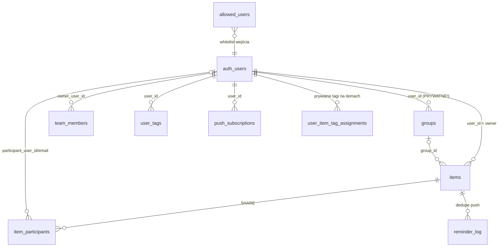
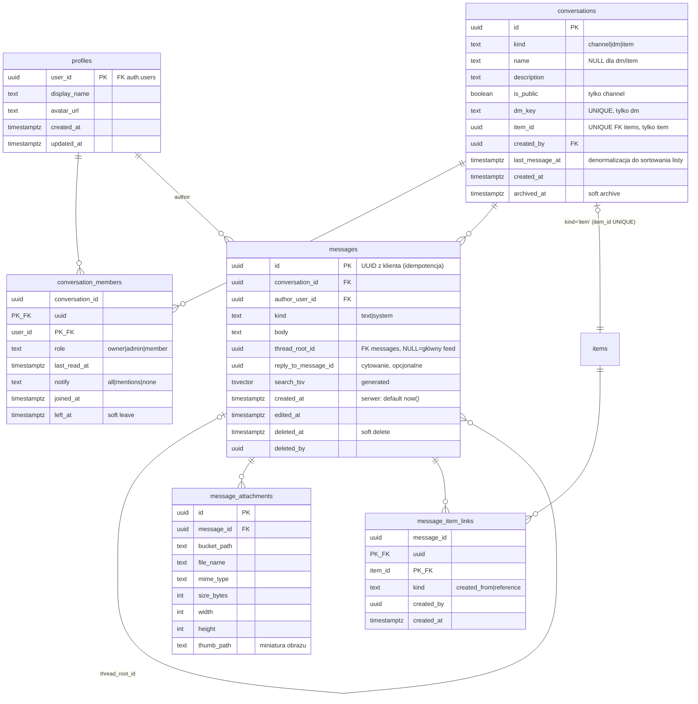

# Komunikator DoDo — dokument architektoniczny i plan wdrożenia

Data: 2026-07-17 · Autor: audyt + projekt architektury (Claude Code)
Status: **projekt do akceptacji — bez implementacji**

---

## CZĘŚĆ I. AUDYT ISTNIEJĄCEJ APLIKACJI

### I.1. Czym aplikacja faktycznie jest (stack)

| Warstwa | Technologia | Uwagi |
|---|---|---|
| Frontend | React 18 + TypeScript + **Vite** (SPA) | To **nie** jest Next.js — brak App Routera, brak SSR |
| Routing | **BRAK** — zero biblioteki routingu | Nawigacja = stan w pamięci (taby w `MobileShell`, `editingId` w store) |
| Stan | Zustand 4 + `persist` → IndexedDB (`idb-keyval`) | Jeden store `src/state/store.ts` (612 linii) |
| Style | Tailwind CSS 3 | Motyw ciemny, tokeny `ink/surface/line/accent` |
| PWA | vite-plugin-pwa + własny `sw.ts` | offline cache + odbiór Web Push |
| Backend | Supabase: Postgres + Auth (Google OAuth + whitelist) + Realtime + Edge Functions | migracje 0001–0012 |
| Push | VAPID Web Push; Edge Function `send-reminders` wołana co minutę przez pg_cron | dedupe w `reminder_log` |
| Testy | Vitest — 38 testów (merge/sync, RRULE, scheduler przypomnień) | |

### I.2. Mapa domen — encje, które JUŻ istnieją



Kluczowe fakty ustalone w audycie (wszystkie są **load-bearing** dla komunikatora):

1. **`Item` = wydarzenie i zadanie to jeden byt** (`type: event|task`), z checklistą,
   uczestnikami, załącznikami i przypomnieniami w kolumnie JSONB `payload`
   (jeden wiersz = cały item). Sync jest snapshotowy per wiersz.
2. **Grupy są PRYWATNE per użytkownik** (`groups.user_id`). „Grupa" w DoDo to
   osobista etykieta kalendarza (kolor + filtr), a **nie** współdzielony zespół.
   To przesądza analizę „grupa vs kanał" (→ D2).
3. **Nie istnieje encja workspace.** Cała instancja to jeden niejawny „dom":
   whitelist `allowed_users` (~10 osób) + Auth Hook `auth-allowlist`.
4. **Nie istnieje globalny katalog użytkowników.** `team_members` to prywatna
   książka adresowa właściciela (per owner), nie profil publiczny. Komunikator
   potrzebuje tabeli `profiles` (→ D0).
5. **SHARE (współdzielenie itemów)** działa per item: `item_participants`
   (status invited/accepted/rejected/active), uczestnik ma RLS-SELECT na item
   i ograniczone zapisy przez RPC `security definer`
   (`update_shared_item_content`, `update_own_participation_status`,
   `update_own_participation_reminders`). Wzorzec RPC-gated writes jest
   sprawdzony i wart powielenia.
6. **Załączniki = base64 w JSONB, limit 5 MB** (`src/lib/attachments.ts`).
   **Supabase Storage nie jest w ogóle używany.** Dla czatu to ślepa uliczka —
   trzeba wprowadzić Storage (→ D8), a przy okazji otwiera się droga do
   migracji załączników itemów.
7. **Sync v2** (`src/lib/cloud.ts`, 977 linii): Supabase = źródło prawdy,
   IndexedDB = cache; dirty-sets + debounce 800 ms na push, pull przy starcie
   i auto-pull ≥60 s w bezpiecznych oknach, merge last-write-wins z tombstone.
   Realtime: jeden kanał `postgres_changes` na `items` + `groups`.
   **Ten silnik jest itemocentryczny i snapshotowy — wiadomości (append-only,
   tysiące wierszy, paginacja) NIE mogą przez niego przechodzić** (→ D11).
8. **Push działa end-to-end**: VAPID, `push_subscriptions` per urządzenie,
   sprzątanie martwych endpointów (404/410), pg_cron co minutę. Dla czatu cron
   minutowy to za wolno — potrzebny trigger/webhook po INSERT (→ D10).
9. **Tożsamość uczestnika po e-mailu** (fallback gdy nie ma konta) — wzorzec
   z `item_participants` (participant_user_id **lub** lower(email) z JWT).
10. **Mobile breakpoint = max-width 1023px** (`useIsMobile`) — tablet dostaje
    szkielet mobilny. Każdy projekt UI musi więc traktować układ mobilny jako
    podstawowy również dla tabletu.

### I.3. Mapa architektury klienta

```
main.tsx → App.tsx
  ├─ AuthGate (Google OAuth gdy cloudEnabled)
  ├─ desktop: Toolbar / CalendarView / SidePanel(380–400px) / GroupRail(90°)
  │            SidePanel = editingId ? ItemEditorPanel : TodoPanel
  └─ mobile (≤1023px): MobileShell
       taby: Dziś (dashboard) · Kalendarz (+) · Zadania (+)
       chipsy filtrów grup · edytor pełnoekranowy · ustawienia bottom-sheet
state/store.ts (Zustand+persist per user: kalendarz-todo-v1-{userId})
lib/cloud.ts  (Sync v2)  lib/syncState.ts (dirty tracking)
lib/push.ts + sw.ts      lib/reminderScheduler.ts (lokalne przypomnienia)
supabase/functions: send-reminders (cron 1 min), auth-allowlist (hook)
```

### I.4. Co reużywamy, czego brakuje

**Do reużycia wprost:**
- Auth + whitelist + Auth Hook (zero zmian).
- Infrastruktura push: `push_subscriptions`, VAPID, wzorzec wysyłki i sprzątania
  endpointów z `send-reminders` → wydzielić wspólny moduł wysyłki dla nowej
  funkcji `notify-message`.
- Wzorzec RPC-gated writes + `security definer` z SHARE.
- Wzorzec tombstone (soft delete) i trigger `preserve_tombstone` z 0010.
- Komponenty UI: `Modal`, chipsy grup, bottom-sheet, tokeny kolorów, `Logo`.
- `team_members` jako podpowiadajka adresatów DM/kanałów (książka adresowa).
- Vitest + istniejąca kultura testów logiki domenowej.

**Czego nie ma (trzeba zbudować):**
- `profiles` (globalny katalog: display name, avatar) — warunek konieczny.
- Supabase Storage + polityki dostępu.
- Jakikolwiek routing/deep-linking (push o wiadomości musi umieć otworzyć
  konkretną rozmowę; link „zadanie ← wiadomość" musi nawigować).
- Model danych czatu w całości.
- Mechanizm push „natychmiast po insercie".

---

## CZĘŚĆ II. ANALIZA PRODUKTOWA

### II.1. Dlaczego pisać w DoDo, a nie na WhatsApp

WhatsApp wygrywa jako uniwersalny komunikator i **nie należy z nim konkurować**.
DoDo wygrywa tam, gdzie rozmowa dotyczy **rzeczy, które już żyją w DoDo**:

1. **Kontekst nie ginie.** Rozmowa o zadaniu „Kupić pellet" jest *w* zadaniu —
   ze zdjęciem paragonu, checklistą i terminem. Na WhatsApp to samo tonie w
   strumieniu 300 wiadomości między memami.
2. **Rozmowa → działanie w 2 tapnięcia.** „Kup pellet do kotłowni" staje się
   zadaniem z autorem, linkiem zwrotnym i przypomnieniem. WhatsApp kończy na
   „aha, ok" i nikt tego nie robi.
3. **Separacja kręgów.** Dom / Budowa / Firma to osobne kanały w jednej
   aplikacji, bez mieszania z prywatnym messengerem i bez 4 grup rodzinnych.
4. **Wspólne artefakty są natywne**: checklisty, terminy, uczestnicy,
   przypomnienia push — WhatsApp nie ma żadnego z nich.
5. **Własna infrastruktura, własne dane** (Supabase, RLS, whitelist).

### II.2. Dlaczego DoDo, a nie Slack

1. Slack to narzędzie pracy — rodzina go nie zainstaluje; DoDo już jest na
   telefonach domowników (kalendarz + zadania).
2. Slack nie ma kalendarza ani zadań rodzinnych; konwersja wiadomość→zadanie
   wymaga płatnych integracji.
3. Koszt: Slack per user; DoDo działa na darmowym/tanim tierze Supabase.
4. Prostota mobile-first dla osób nietechnicznych vs. workspace'y, thready,
   apki i onboarding Slacka.

### II.3. Jakie problemy komunikator MA rozwiązywać

- Decyzje i ustalenia giną w czatach zewnętrznych („gdzie to było?").
- Zadania „urodzone w rozmowie" nie trafiają nigdzie — brak śladu i terminu.
- Koordynacja wydarzenia wymaga skakania między aplikacjami.
- Materiały (zdjęcie, PDF, oferta) nie są przypięte do sprawy, której dotyczą.
- Rozmowy „operacyjne" (budowa, firma) mieszają się z prywatnymi.

### II.4. Jak NIE zbudować kolejnego messengera

- **Każda rozmowa jest zakotwiczona**: kanał ma temat-obszar, wątek
  kontekstowy ma zadanie/wydarzenie. Nie ma „czatu w próżni".
- **Akcje są pierwszoklasowe**: konwersja i linkowanie widoczne w UI na
  poziomie pojedynczej wiadomości, nie schowane w menu.
- **Jawne non-goals**: brak rozmów głosowych/wideo, brak naklejek, brak E2EE,
  brak statusów „dostarczono" per wiadomość, brak federacji. To kanał
  operacyjny, nie zamiennik WhatsAppa.
- **Metryka sukcesu**: odsetek wiadomości powiązanych z itemami i liczba
  zadań utworzonych z wiadomości — nie liczba wysłanych wiadomości.

### II.5. Przewagi, zagrożenia, ryzyka

**Przewagi:** integracja z istniejącym grafem (items/uczestnicy/przypomnienia);
gotowy push; gotowa tożsamość i whitelist; mały, zamknięty krąg użytkowników
(łatwy onboarding); pełna kontrola danych.

**Ryzyka produktowe:**
- *Split-brain adopcji* — rodzina zostanie na WhatsApp. Mitigacja: klinem są
  **komentarze kontekstowe + wiadomość→zadanie** (wartość niedostępna gdzie
  indziej), kanały są dodatkiem, nie odwrotnie.
- *Zmęczenie powiadomieniami* — push z czatu obok push z przypomnień.
  Mitigacja: rozsądne domyślne (DM: wszystko; kanał: wszystko z łatwym mute;
  komentarze: tylko uczestnicy itemu), osobny „tag" powiadomień czatu.
- *Puste pokoje* — mitigacja: wątki itemów tworzą się leniwie przy pierwszym
  komentarzu; brak sztucznych kanałów na start (jeden „Dom" seedowany).
- *Feature creep* w stronę pełnego messengera — pilnować non-goals.

**Ryzyka techniczne:** (szczegóły w D-decyzjach i planie)
- rekurencja RLS na `conversation_members` (klasyczna pułapka Supabase),
- podwójne DM przy równoczesnym utworzeniu (dedupe kluczem kanonicznym),
- przenoszenie wiadomości przez istniejący snapshotowy sync (zakaz — osobny
  moduł), rozrost IndexedDB,
- egress/storage na zdjęciach (pierwszy realny limit darmowego tieru),
- iOS push tylko dla zainstalowanej PWA (znane ograniczenie, już opisane).

---

## CZĘŚĆ III. DECYZJE ARCHITEKTONICZNE (D0–D12)

### D0. Nowa tabela `profiles` (warunek wstępny)

Globalny, minimalny katalog użytkowników: `user_id (PK, FK auth.users)`,
`display_name`, `avatar_url`, `created_at/updated_at`. Wypełniany triggerem
po utworzeniu konta (z metadanych Google) + backfill istniejących kont.
RLS: SELECT dla wszystkich zalogowanych (instancja = zamknięty krąg),
UPDATE tylko własnego wiersza. Bez tego nie da się pokazać „kto napisał"
ani wybrać adresata DM spoza własnego `team_members`.

### D1. Jedna encja `conversations` z trzema rodzajami

```
conversations.kind = 'channel' | 'dm' | 'item'
```

- **channel** — nazwany, opcjonalny opis, `is_public` (publiczny = widoczny
  i dołączalny dla każdego z whitelisty; prywatny = tylko członkowie).
- **dm** — 1:1 lub mała grupa prywatna; bez nazwy (nazwa = uczestnicy);
  dedupe: kolumna `dm_key` = posortowane user_id złączone `:` , UNIQUE
  (rozwiązuje wyścig dwóch osób tworzących ten sam DM).
- **item** — wątek kontekstowy zadania/wydarzenia; `item_id UNIQUE FK items`;
  tworzony **leniwie** przy pierwszym komentarzu; członkostwo pochodne od
  dostępu do itemu (owner + uczestnicy SHARE).

**Dlaczego jedna encja:** wiadomości, załączniki, nieprzeczytane, wyszukiwarka,
push — jeden pipeline dla trzech przypadków. Osobne encje (DM vs kanał vs
komentarze) potroiłyby RLS, realtime i UI bez żadnej korzyści.

### D2. Grupa ≠ kanał (analiza wymagana w briefie)

| Podejście | Plusy | Minusy |
|---|---|---|
| A. Grupa i kanał = ta sama encja | jedna lista bytów | **niemożliwe bez przebudowy**: `groups` są prywatne per user (kolor/filtr kalendarza), kanał musi być współdzielony; scalenie = migracja wszystkich grup wszystkich użytkowników + zmiana semantyki filtrów |
| B. Kanał wskazuje grupę (FK) | „powiązanie" z briefu | FK wskazywałby prywatny wiersz jednego użytkownika — dla pozostałych członków kanału to obcy, niewidoczny rekord; RLS by to blokował |
| C. **Kanał = osobna encja, bez FK do groups** (rekomendacja) | czysta semantyka: grupa = prywatna etykieta, kanał = współdzielony pokój; zero migracji istniejących danych | „powiązanie z grupą" tylko wizualne |

Rekomendacja: **C**. Jeżeli w przyszłości potrzebne będzie „kanał w kolorze
mojej grupy Budowa", dodać per-użytkownika mapowanie kosmetyczne
(kolumna w `conversation_members`), nie FK między encjami.

### D3. DM-y — nie osobna encja

DM to `conversation(kind='dm')` + `conversation_members`. Wspólny model
„Conversation" (pytanie z briefu): **tak** — patrz D1. Limit członków DM
(np. 8) egzekwowany w RPC tworzącym rozmowę; powyżej — załóż kanał prywatny.

### D4. Komentarze kontekstowe = technicznie wiadomości (rekomendacja)

| Wariant | Plusy | Minusy |
|---|---|---|
| Osobna encja `item_comments` | prostszy RLS (dziedziczy po itemie) | drugi pipeline: osobny realtime, push, załączniki, wyszukiwarka, nieprzeczytane, UI; komentarza nie da się „przenieść do rozmowy" ani linkować spójnie |
| **Komentarz = message w conversation(kind='item')** | jeden pipeline na wszystko; licznik nieprzeczytanych komentarzy tym samym mechanizmem; wiadomość→zadanie→dyskusja domyka pętlę | członkostwo musi być pochodną dostępu do itemu (RLS odrobinę trudniejszy) |

Rekomendacja: **komentarz = wiadomość.** Członkostwo wątku itemowego liczone
funkcją pomocniczą (owner itemu ∪ aktywni uczestnicy SHARE), synchronizowane
do `conversation_members` przy zmianach uczestników (trigger lub przy
zapisie uczestników w istniejącym `syncItemParticipants`).

### D5. Wątki (threads) w stylu Slack

Model: `messages.thread_root_id` (NULL = wiadomość główna). Odpowiedzi żyją
w tej samej rozmowie; feed główny filtruje `thread_root_id IS NULL`, root
niesie licznik odpowiedzi (zliczany zapytaniem, bez denormalizacji w MVP).
Bez osobnych kanałów — zgodnie z briefem.

**UX mobile:** wątek otwiera się jako **pełnoekranowy widok** (wzór: Slack
mobile) — root przypięty u góry, odpowiedzi niżej, composer na dole. Na
desktopie wątek w prawym panelu. Wejście: tap w plakietkę „N odpowiedzi".

Uwaga kalibracyjna: dla kręgu rodzinnego wątki bywają zbyt „slackowe".
Kolumna w modelu jest tania — **dane wspierają wątki od dnia 1**, ale UI
wątków planowo wchodzi pod koniec Fazy 1 i może zostać wyłączony flagą,
jeśli okaże się zbędny (fallback: cytowanie `reply_to_message_id`).

### D6. Statusy przeczytania — `last_read_at`, nie per-message receipts

Model optymalny dla 10–50 osób:

- `conversation_members.last_read_at timestamptz` — jeden UPDATE przy
  wejściu/scrollu do końca rozmowy.
- **Licznik nieprzeczytanych** = COUNT wiadomości `created_at > last_read_at`
  i `author ≠ ja` — liczony po stronie serwera jednym RPC
  `get_conversation_overview()` (lista rozmów + ostatnia wiadomość + unread).
- **„Przeczytano przez X, Y"** w małych rozmowach: pochodna z `last_read_at`
  członków („przeczytali do tego miejsca") — zero dodatkowych tabel.
- **„Dostarczono"** — świadomie POZA zakresem (wymaga potwierdzeń z każdego
  urządzenia; szum bez wartości w tym gronie). Model tego nie blokuje
  (ewentualna przyszła tabela `message_receipts`).

Odrzucone: tabela receipts per (message × user) — przy 50 użytkownikach
i 10⁵ wiadomości to miliony wierszy bez żadnej wartości produktowej.

### D7. Wiadomość → zadanie / wydarzenie

Nowa tabela `message_item_links (message_id, item_id, kind, created_by,
created_at)`; `kind = 'created_from' | 'reference'`. Do tego w `items.payload`
lekki wskaźnik `sourceMessageRef {conversationId, messageId}` (payload jest
JSONB — **zero migracji tabeli items**, istniejący sync przenosi to za darmo).

Przepływ UX: long-press / menu wiadomości → „Utwórz zadanie" (albo
„Utwórz wydarzenie") → otwiera się istniejący edytor jako **draft**
(`startDraft`) z prefill: `title` = pierwsza linia treści, `description` =
pełna treść + autor, typ zgodny z wyborem; po `commitDraft` zapisywany jest
link. Wydarzenie dodatkowo dostaje propozycję daty (parsowanie dat w treści —
POZA MVP, na razie ręcznie).

Nawigacja dwukierunkowa: chip „→ zadanie" pod wiadomością; sekcja
„Źródło: rozmowa" w edytorze itemu; wpis systemowy `kind='system'` w rozmowie
(„Ala utworzyła zadanie Kupić pellet"). Historia zmian itemu — POZA zakresem
(nie budujemy audit logu itemów w tym projekcie).

Wymaganie infrastrukturalne: **deep-linking** (→ D12).

### D8. Załączniki — Supabase Storage (nowy bucket `chat-attachments`)

- Ścieżka: `conversation_id/message_id/uuid-nazwa.ext`; metadane w tabeli
  `message_attachments (id, message_id, bucket_path, file_name, mime_type,
  size_bytes, width, height, created_at)`.
- **Polityki Storage**: INSERT/SELECT gdy `is_conversation_member()` dla
  `conversation_id` wyciętego z ścieżki; DELETE tylko autor wiadomości.
  Bucket prywatny; odczyt przez **signed URLs** (TTL ~1 h, cache w SW).
- Limity: 25 MB/plik (zdjęcia, PDF, dokumenty); **obrazy kompresowane
  po stronie klienta** (canvas → WebP, dłuższy bok ~1600 px, miniatura
  ~320 px zapisywana obok) — to jest główna obrona przed limitem egress
  darmowego tieru, ważniejsza niż jakikolwiek tuning bazy.
- Wersjonowanie plików: **nie** (nadpisań nie ma — załącznik jest immutable,
  edycja = nowy plik). Kasowanie wiadomości = soft delete; obiekt w Storage
  usuwany przez sprzątaczkę (cron tygodniowy) po 30 dniach.
- Synergia (poza zakresem tego projektu, odnotować): migracja załączników
  itemów z base64/JSONB do tego samego wzorca Storage.

### D9. Wyszukiwarka globalna — Postgres FTS

- Postgres **nie ma konfiguracji `polish`** — używamy `simple` + rozszerzenie
  `unaccent` (wyszukiwanie bez odmiany, ale odporne na diakrytykę) oraz
  `pg_trgm` (GIN) jako fallback substring/literówki.
- Kolumny generowane `search_tsv` na: `messages.body`,
  `items.title || description`; GIN-y na obu + GIN trgm na `messages.body`
  i `items.title`.
- Jeden RPC `search_all(p_query)` (security **invoker** — RLS filtruje
  dostęp naturalnie) zwracający unię otagowanych wyników:
  wiadomości (w tym komentarze i wątki — to też messages), itemy
  (zadania+wydarzenia), pliki (po `file_name` z `message_attachments`).
- Ranking: `ts_rank` + świeżość; limit 20/kategorię, paginacja keyset.
- Skala 10–50 osób: FTS w Postgresie jest przewymiarowany in plus; żadnych
  zewnętrznych indeksów (Meilisearch itd.) — nie w tym wszechświecie skali.

### D10. Realtime — zakres MVP

| Mechanizm | MVP? | Jak |
|---|---|---|
| Nowe wiadomości na żywo | **TAK** | `postgres_changes` INSERT/UPDATE na `messages` (RLS/WALRUS filtruje per subskrybent); jeden kanał globalny na zalogowanego użytkownika + dogrywka historii przy otwarciu rozmowy |
| Liczniki nieprzeczytanych na żywo | **TAK** | pochodna zdarzeń messages + `conversation_members` (UPDATE last_read_at innych urządzeń tego samego usera) |
| Push o nowej wiadomości | **TAK** | Database Webhook / trigger `pg_net` po INSERT → Edge Function `notify-message` (adresaci = członkowie − autor − mute; szanuje `last_read_at`) |
| Edycja/kasowanie na żywo | **TAK** | to UPDATE na messages — ten sam kanał |
| Typing indicator | **NIE** (odłożone) | gdy wejdzie: Supabase Broadcast (efemeryczny, zero zapisu do DB) |
| Obecność online | **NIE** (odłożone) | gdy wejdzie: Supabase Presence; w rodzinie „online" bywa antyfeature'em |
| Dostarczono/odczytano per wiadomość | **NIE** (świadomie nigdy-chyba-że) | patrz D6 |

Uzasadnienie cięcia: typing/presence to koszt UI+testów bez wpływu na pętlę
wartości (rozmowa→działanie), a każda odłożona rzecz ma znaną ścieżkę wejścia.

### D11. Offline i synchronizacja czatu — OSOBNY moduł, nie Sync v2

Zasada nadrzędna: **wiadomości nie dotykają `cloud.ts` ani głównego persist
store'a.** Sync v2 jest snapshotowy (dirty→upsert całych wierszy itemów);
czat jest append-only ze strumieniem i paginacją. Mieszanie tych modeli
to najprostszy sposób na regresję kalendarza.

Projekt: `src/lib/chat/` + **osobny store Zustand** (`chatStore`) z własną
persystencją IDB:

- **Cache odczytu**: ostatnie ~50 wiadomości per rozmowa + lista rozmów
  (overview) — czytelne offline, przycinane (cap globalny ~2000 wiadomości).
- **Outbox**: wysyłka = INSERT z **UUID generowanym po stronie klienta**
  (idempotentny retry bez duplikatów), optymistyczny bąbelek w stanie
  `pending` → `sent` po ACK → `failed` z przyciskiem ponów po timeout.
  Kolejka w IDB przeżywa restart aplikacji; flush po `online`/focus.
- **Paginacja**: keyset po `(created_at, id)` w dół (starsze) przy scrollu.
- **Porządek**: `created_at` nadaje serwer (`default now()`); wiadomości
  optymistyczne re-sortowane po ACK; brak zaufania do zegara klienta.
- Konflikty: nie istnieją (append-only); edycja własnej wiadomości = LWW
  na jednym wierszu jednego autora.

### D12. Nawigacja / deep-linking — mini hash-router

Aplikacja nie ma routera, a czat go wymaga (push → konkretna rozmowa,
chip „→ zadanie" → edytor, link zwrotny → rozmowa). Rekomendacja:
**lekki hash-routing bez react-routera** (nowy moduł `lib/navigation.ts`):

```
#/czat                     → lista rozmów
#/czat/{conversationId}    → rozmowa
#/czat/{cid}/watek/{mid}   → wątek
#/wpis/{itemId}            → edytor itemu (mapuje na setEditing)
```

Zmiana hash ↔ stan store (dwukierunkowo, z guardem). SW/push `click` →
`clients.openWindow('/#/czat/…')`. Pełny react-router = niepotrzebna
przebudowa App.tsx; hash wystarcza SPA bez SSR.

---

## CZĘŚĆ IV. MODEL DANYCH

### IV.1. Diagram encji (nowe + powiązania z istniejącymi)



Constrainty spójności rodzaju (CHECK): `channel ⇒ name NOT NULL`,
`dm ⇒ dm_key NOT NULL`, `item ⇒ item_id NOT NULL`; pozostałe pola NULL.

### IV.2. Indeksy

- `messages (conversation_id, created_at DESC, id)` — feed + keyset paginacja
  (najważniejszy indeks całego systemu).
- `messages (thread_root_id, created_at)` WHERE thread_root_id IS NOT NULL.
- `messages (conversation_id, created_at)` WHERE deleted_at IS NULL AND
  thread_root_id IS NULL — licznik nieprzeczytanych.
- GIN `messages.search_tsv`; GIN trgm `messages.body`.
- `conversation_members (user_id)` — „moje rozmowy"; PK złożony
  `(conversation_id, user_id)` obsługuje kierunek odwrotny.
- `conversations (last_message_at DESC)`; UNIQUE `dm_key`; UNIQUE `item_id`.
- `message_item_links (item_id)` — backlinki z edytora itemu.

### IV.3. RLS — zasady (opisowo)

Fundament: funkcja `is_conversation_member(p_conversation_id, p_user_id)`
jako **security definer** (STABLE) — przerywa rekurencję polityk
member↔conversation (klasyczna pułapka Supabase; polityka na
`conversation_members` nie może sama SELECT-ować z `conversation_members`
w trybie invoker). Dla `kind='item'` funkcja honoruje dostęp pochodny:
owner itemu ∪ aktywni uczestnicy `item_participants`.

| Tabela | SELECT | INSERT | UPDATE | DELETE |
|---|---|---|---|---|
| conversations | członek; `channel AND is_public` — każdy zalogowany (discovery) | przez **RPC** `create_conversation` (walidacja kind/dm_key/limitów) | owner/admin (nazwa, opis, archiwizacja) | nie (soft archive) |
| conversation_members | członek tej samej rozmowy (przez funkcję) | RPC `join_channel` (public), RPC zapraszania (admin), samo-dołączenie do public | własny wiersz: `last_read_at`, `notify`, `left_at`; admin: role | nie (soft leave) |
| messages | członek rozmowy | członek ∧ `author = auth.uid()` ∧ rozmowa niezarchiwizowana | autor (body/edited_at) oraz autor/admin (deleted_at) — soft | nie |
| message_attachments | jak messages (join) | autor wiadomości | nie | autor (przy kasowaniu wiadomości) |
| message_item_links | widzi kto widzi wiadomość LUB item (dwie polityki OR) | członek rozmowy z dostępem do itemu | nie | twórca linku |
| profiles | każdy zalogowany | trigger systemowy | własny wiersz | nie |

Zapisy „grubsze" (tworzenie rozmów, dołączanie, zapraszanie) przez RPC
security definer — powiela sprawdzony wzorzec SHARE i utrzymuje polityki
tabel prostymi.

### IV.4. Plan migracji (numeracja kontynuuje 0012)

| Migracja | Zawartość | Zależności |
|---|---|---|
| `0013_profiles.sql` | profiles + trigger on auth.users + backfill + RLS | — |
| `0014_chat_core.sql` | conversations, conversation_members, messages, message_item_links; CHECK-i; indeksy; `is_conversation_member`; RLS; RPC: create_conversation, join_channel, invite_member, get_conversation_overview, mark_read; publikacja realtime (messages, conversations, conversation_members); trigger `last_message_at`; trigger członkostwa wątków itemowych przy zmianie item_participants | 0013 |
| `0015_chat_storage.sql` | bucket `chat-attachments` + polityki storage.objects; tabela message_attachments + RLS | 0014 |
| `0016_chat_search.sql` | unaccent, pg_trgm; kolumny generowane search_tsv (messages, items); GIN-y; RPC search_all | 0014 |
| `0017_chat_push.sql` | trigger pg_net po INSERT na messages → `notify-message` (albo Database Webhook z dashboardu — preferowane, bo bez sekretu w SQL); sprzątaczka storage/soft-deleted (pg_cron, tygodniowo) | 0014, 0015 |

Edge Functions: nowa `notify-message` (współdzielony moduł web-push wydzielony
z `send-reminders`); `send-reminders` bez zmian.

### IV.5. Realtime subscriptions (klient)

Jeden kanał na zalogowanego użytkownika (`chat-{userId}`):
`postgres_changes` na `messages` (INSERT+UPDATE), `conversations`
(UPDATE — archiwizacja/nazwa/last_message_at), `conversation_members`
(UPDATE — last_read_at z innych urządzeń, nowe członkostwa). RLS ogranicza
strumień do rozmów użytkownika. Po `online`/focus: re-fetch overview
(uzupełnienie luk po utracie połączenia — realtime nie gwarantuje dostarczenia).
Wymóg: `supabase.realtime.setAuth()` po odświeżeniu tokenu (w kliencie już
jest obsługa auth state change — dopiąć).

### IV.6. Offline sync — podsumowanie kontraktu

- Odczyt: cache IDB (overview + ogon 50 wiadomości/rozmowa); UI czytelne offline.
- Zapis: outbox IDB, UUID klienta, retry idempotentny, stany pending/failed.
- Prawda: zawsze serwer; `created_at` serwerowy; brak merge poza LWW edycji własnych.
- Główny store i `cloud.ts`: **nietknięte**.

---

## CZĘŚĆ V. UX I NAWIGACJA

### V.1. Analiza wariantów

- **Opcja A — zakładka „Komunikacja"**: pełny hub (kanały+DM). Plus: jedno
  miejsce, liczniki w jednym punkcie. Minus: sama z siebie nie niesie
  przewagi produktowej (to layout messengera).
- **Opcja B — zakładka „Chat"**: jak A, węższa nazwa; bez różnicy technicznej.
- **Opcja C — komunikacja rozproszona** (tylko komentarze przy itemach,
  bez centralnego widoku): Plus: najbliżej wizji „rozmowa przy działaniu".
  Minus: brak miejsca na DM/kanały, brak jednego wejścia „co nowego",
  liczniki rozsiane po aplikacji.

**Rekomendacja: hybryda A+C.** Centralna zakładka **„Czat"** (krótka etykieta —
mieści się w segmencie mobilnym) z listą rozmów (kanały, DM **oraz aktywne
wątki itemów** — te ostatnie z ikoną zadania/wydarzenia i skokiem do itemu),
plus **komentarze osadzone w edytorze itemu** (sekcja „Dyskusja"). Wątek
itemowy jest jedną i tą samą rozmową widzianą z dwóch miejsc.

### V.2. Mobile (≤1023 px — także tablet!) — projekt podstawowy

- Czwarty segment w istniejącym pasku: `Dziś · Kalendarz · Zadania · Czat`
  (+ badge nieprzeczytanych na segmencie; segmenty już są elastyczne).
- **Lista rozmów**: sortowanie po `last_message_at`; wiersz = avatar/kolor,
  nazwa, ostatnia wiadomość, czas, badge unread; przycisk [+] (nowy DM /
  nowy kanał) w konwencji istniejących [+] przy tabach.
- **Widok rozmowy**: pełnoekranowy (wzorzec istniejącego edytora itemu),
  nagłówek z nazwą i wejściem w szczegóły (członkowie, mute, archiwum),
  feed z paginacją w górę, composer z załącznikiem (aparat/galeria/plik).
- **Akcje wiadomości**: long-press → arkusz dolny (istniejący wzorzec
  bottom-sheet): Odpowiedz w wątku · Cytuj · **Utwórz zadanie** ·
  **Utwórz wydarzenie** · Kopiuj · Edytuj/Usuń (własne).
- **Wątek**: pełny ekran (D5). **Komentarze itemu**: sekcja „Dyskusja" na
  końcu edytora (składana, z licznikiem), reużywa ten sam komponent feedu.
- Kciuk-first: composer i akcje na dole; brak hoverów; cele dotyku ≥44 px.

### V.3. Desktop (>1023 px)

- `SidePanel` dostaje przełącznik trybu **Zadania | Czat** (toolbar już ma
  toggle panelu — rozszerzenie naturalne). Lista rozmów i rozmowa w panelu
  380–400 px; wątek zastępuje widok rozmowy z przyciskiem wstecz.
- Kalendarz pozostaje zawsze widoczny — zgodnie z DNA aplikacji (czat ma być
  obok pracy, nie zamiast niej). Pełnoekranowy widok czatu: nie w MVP.
- Komentarze itemu: identyczna sekcja „Dyskusja" w `ItemEditorPanel`
  (jako **osobny, leniwie ładowany komponent** — edytor ma już 1737 linii
  i nie wolno go dalej zasilać kodem inline).

### V.4. Nowe komponenty (mapa)

```
src/components/chat/
  ChatTab.tsx            lista rozmów (mobile tab / tryb SidePanel)
  ConversationView.tsx   feed + composer (współdzielony mobile/desktop)
  ThreadView.tsx         wątek
  MessageBubble.tsx      bąbelek + chips linków (→ zadanie/wydarzenie)
  MessageComposer.tsx    input + załączniki + wysyłka przez outbox
  MessageActionsSheet.tsx
  ItemDiscussion.tsx     sekcja „Dyskusja" w ItemEditorPanel (lazy)
  NewConversationDialog.tsx
src/lib/chat/            chatStore, chatApi, chatRealtime, chatOutbox, chatCache
src/lib/navigation.ts    mini hash-router (D12)
supabase/functions/notify-message/
```

---

## CZĘŚĆ VI. SKALOWANIE — 10–50 UŻYTKOWNIKÓW, 2–10 KRĘGÓW

Rzędy wielkości: 50 osób × 50 wiadomości/dzień = 2 500/dzień ≈ **75 tys.
wiadomości/miesiąc** — dla Postgresa to nic (tabela messages po roku < 1 mln
wierszy, indeks feedu trzyma stałą wydajność).

Separacja 2–10 kręgów osób: **kanały prywatne + DM są mechanizmem separacji**
(brak encji workspace). Uwaga projektowa: kanał `is_public` jest widoczny dla
CAŁEJ whitelisty — przy rozłącznych kręgach (rodzina vs firma) public channels
używać świadomie albo wcale; domyślne przy tworzeniu: **prywatny**. Gdyby
instancja miała kiedyś obsłużyć prawdziwe rozłączne organizacje — wtedy (i
dopiero wtedy) dodaje się encję workspace; model conversations przeżyje to
bez zmian (kolumna workspace_id).

Wąskie gardła, w kolejności realnego ryzyka:

1. **Egress + storage na zdjęciach** (free tier: 5 GB egress, 1 GB storage).
   To jedyny limit osiągalny w praktyce. Mitigacje: kompresja klienta (D8),
   miniatury w feedzie (pełny plik dopiero po tapnięciu), cache signed URLs
   w SW, ewentualnie Pro tier ($25) gdy zdjęcia ruszą na dobre.
2. **Realtime**: free tier ~200 równoczesnych połączeń / 2 mln wiadomości
   miesięcznie — 50 osób × 2 urządzenia = maks ~100 połączeń; zapas duży.
   RLS-owa filtracja `postgres_changes` (WALRUS) jest liczona per subskrybent
   per zmiana — przy 50 subskrybentach niezauważalne; ścieżka ewolucji przy
   wzroście: broadcast-from-database.
3. **Push**: wysyłka po każdym INSERT; przy gadatliwym kanale = seria pushy.
   Mitigacja w `notify-message`: collapse per rozmowa (tag powiadomienia =
   conversationId — system nadpisuje poprzednie powiadomienie zamiast je
   dublować) + szanowanie mute.
4. **IndexedDB klienta**: cap cache (D11) i przycinanie — bez tego telefon
   po roku nosi całą historię.
5. **Zapytanie o liczniki nieprzeczytanych** (N rozmów × COUNT): przy 50
   rozmowach nadal tanie z indeksem częściowym; RPC overview liczy wszystko
   jednym zapytaniem (lateral), nie N+1 z klienta.
6. **Pauza projektu free tier po tygodniu nieaktywności** — istniejący cron
   minutowy już trzyma projekt przy życiu (odnotowane, bez działania).

---

## CZĘŚĆ VII. PLAN WDROŻENIA

Konwencja etykiet zgodna z repo (SYNCFIX/UXFIX…): proponowane kody **CHAT1…**.
Złożoność: S (≤0,5 dnia), M (1–2 dni), L (3–5 dni) — dni robocze jednej osoby
z Claude Code; realnie sesje.

### FAZA 1 — wdrożenie kompleksowe

Kolejność = kolejność realizacji; każdy krok kończy się działającą aplikacją.

| # | Kod | Zakres | Zależy od | Złożoność | Główne ryzyka |
|---|---|---|---|---|---|
| 1.1 | CHAT1-DB | Migracje 0013+0014 (profiles, rdzeń czatu, RLS, RPC, realtime); testy RLS w SQL (role-play przez `set request.jwt.claims`) | — | **L** | rekurencja RLS (mitigacja: `is_conversation_member` security definer od początku); członkostwo pochodne wątków itemowych |
| 1.2 | CHAT1-NAV | `lib/navigation.ts` (hash-router) + mapowanie `#/wpis/{id}` na istniejący edytor | — | **S** | podwójne źródło prawdy hash↔store (guard na pętlę) |
| 1.3 | CHAT1-CORE | `lib/chat/*`: chatStore (osobny Zustand+IDB), chatApi (overview, feed, send), outbox z UUID klienta, realtime subskrypcja, mark_read | 1.1 | **L** | przeciek do Sync v2 (zakaz importów z cloud.ts); porządek wiadomości optymistycznych |
| 1.4 | CHAT1-UI | ChatTab + ConversationView + Composer + NewConversationDialog; 4. segment mobile z badge; tryb Czat w SidePanel desktop | 1.2, 1.3 | **L** | wydajność długiej listy (paginacja od 1. dnia); klawiatura mobilna vs composer (visualViewport) |
| 1.5 | CHAT2-ITEM | Wątki itemowe: lazy-create conversation kind='item', `ItemDiscussion` w edytorze (lazy component), synchronizacja członkostwa z item_participants, wpisy systemowe | 1.3 | **M** | edytor-monolit (dyscyplina: osobny plik); dostęp uczestnika po e-mailu bez konta |
| 1.6 | CHAT2-LINK | Wiadomość→zadanie/wydarzenie: message_item_links, akcje w MessageActionsSheet, prefill draftu, chipsy i backlinki obu stron | 1.4, 1.5 | **M** | spójność przy skasowanym celu (chip „usunięte") |
| 1.7 | CHAT3-FILES | Migracja 0015 + bucket + polityki; upload z kompresją i miniaturą; galeria w feedzie; signed URLs + cache SW | 1.4 | **M/L** | polityki storage (ścieżka→membership); iOS Safari a canvas/WebP (fallback JPEG) |
| 1.8 | CHAT3-PUSH | 0017 + Edge Function `notify-message` (współdzielony moduł web-push z send-reminders); collapse per rozmowa; mute per członek; SW click→deep link | 1.3, 1.2 | **M** | podwójne powiadomienia (osobny tag czatu); webhook auth |
| 1.9 | CHAT4-THREADS | ThreadView (mobile pełny ekran / desktop w panelu), liczniki odpowiedzi; flaga wyłączająca UI wątków | 1.4 | **M** | nadmiar UX dla rodziny — stąd flaga |
| 1.10 | CHAT4-SEARCH | Migracja 0016 + RPC search_all + UI wyszukiwarki (pole w ChatTab; wyniki: wiadomości/itemy/pliki) | 1.1 | **M** | polszczyzna bez stemmingu (unaccent+trgm wystarczą; ocenić po użyciu) |

Suma Fazy 1: ~9–12 sesji. Punkt „minimalnie użyteczny do domowej bety" jest
już po 1.6 (rozmowy + komentarze + konwersje, bez plików/push).

### FAZA 2 — kontrola i testy

| Zakres | Szczegóły | Złożoność |
|---|---|---|
| Testy jednostkowe | outbox (retry/idempotencja/porządek), chatCache (cap/przycinanie), reduktor unread, parser hash-routera, prefill konwersji | M |
| Testy RLS/SQL | matryca dostępu: nie-członek/członek/admin/uczestnik-SHARE-bez-konta × SELECT/INSERT/UPDATE na wszystkich tabelach czatu + storage | M |
| Test E2E ręczny wg scenariusza | 2 konta × 2 urządzenia: DM, kanał public/prywatny, wątek itemu, konwersja, plik, push przy zamkniętej PWA (Android + iOS), offline outbox (tryb samolotowy → wysyłka po powrocie) | M |
| Kontrola regresji rdzenia | pełny `npm test` + ręczny smoke kalendarza/zadań/SHARE/przypomnień — dowód, że Sync v2 nietknięty | S |
| Ryzyka | najwięcej niespodzianek historycznie: iOS PWA (push, klawiatura, safe-area) — zostawić na to bufor | — |

### FAZA 3 — poprawki (drobne)

Przewidywane z góry (z audytu i doświadczeń repo): dostrojenie badge'y i
momentu mark_read (scroll vs otwarcie), kolejność rozmów przy wiadomościach
offline, kosmetyka bąbelków/kontrastów w motywie, treści powiadomień
(skróty, polskie formaty czasu — wzorzec z send-reminders), puste stany
(pierwsze uruchomienie, brak rozmów), copy PL. Złożoność: S–M łącznie;
zbierane z bety domowej (ta sama pętla co przy push/SHARE).

### FAZA 4 — ostateczne sprawdzenia

- Przegląd bezpieczeństwa: ponowna matryca RLS + storage policies + próba
  dostępu przez REST bez UI (curl z tokenem nie-członka).
- Budżety: rozmiar bundle (czat ładowany lazy — sprawdzić split), zużycie
  IDB po tygodniu, egress po tygodniu zdjęć.
- Sprzątaczka storage + retencja (cron) uruchomiona i zweryfikowana.
- Dokumentacja: aktualizacja README (sekcja Komunikator: migracje 0013–0017,
  deploy notify-message, webhook) + wpis w docs/ analogiczny do AUDYT-*.
- Commit/push — dyscyplina repo (w repo bywały długie WIP-y niezacommitowane;
  tu commitować per krok 1.x).

### Zależności zewnętrzne (jednorazowe, ręczne)

1. Wykonanie migracji 0013–0017 w SQL Editorze (kolejno).
2. `supabase functions deploy notify-message --no-verify-jwt` + sekrety
   (VAPID już są; ewent. sekret webhooka).
3. Utworzenie Database Webhook w dashboardzie (INSERT messages → funkcja).
4. Utworzenie bucketu `chat-attachments` (SQL w 0015 lub dashboard).

---

## ZAŁĄCZNIK: rzeczy świadomie POZA zakresem

Rozmowy audio/wideo · E2EE · statusy „dostarczono" per wiadomość · typing
indicator i presence (odłożone z planem wejścia, D10) · reakcje emoji (tanie,
ale nie MVP — kandydat do Fazy 3 jeśli beta o nie poprosi) · wzmianki @user
z powiadomieniem (kandydat na CHAT5) · parsowanie dat z treści przy konwersji
na wydarzenie · encja workspace · migracja załączników itemów do Storage
(osobny projekt-synergia) · edycja historii itemów / audit log.
