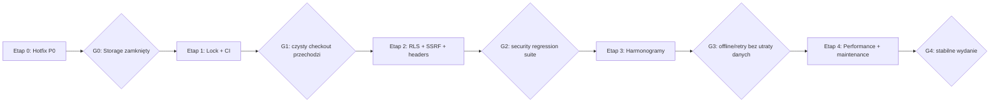

# Plan poprawy i napraw aplikacji DoDo

**Data:** 23 sierpnia 2026  
**Dokument bazowy:** [`ANALIZA-APLIKACJI-2026-08-23.md`](./ANALIZA-APLIKACJI-2026-08-23.md)  
**Punkt startowy:** commit `a6ea61c`, migracje do `0063`  
**Cel:** usunięcie ryzyk bezpieczeństwa i utraty danych, przywrócenie powtarzalnych buildów oraz zbudowanie kontroli jakości bez zatrzymywania produktu na długi refactor.

## 1. Założenia planu

### 1.1. Priorytety

Kolejność jest celowa:

1. **Bezpieczeństwo danych** — zamknięcie dostępu do helperów Storage.
2. **Powtarzalność** — działające `npm ci` i przypięty toolchain.
3. **Kontrola zmian** — CI, testy migracji i RLS.
4. **Niezawodność zapisu** — szczególnie Harmonogramy.
5. **Hardening** — SSRF, nagłówki, zależności i obserwowalność.
6. **Wydajność i utrzymanie** — bundle, dokumentacja, dostępność i stopniowy podział monolitów.

Do zakończenia etapów 0–2 rekomendowane jest **zamrożenie nowych dużych funkcji**. Dopuszczalne są poprawki P0/P1 i małe naprawy regresji.

### 1.2. Szacunki

Szacunki podano w osobodniach dla jednej osoby znającej TypeScript, PostgreSQL/Supabase i Cloudflare. Nie obejmują czasu oczekiwania na akceptację użytkowników ani zewnętrzne usługi.

| Zakres | Szacunek |
|---|---:|
| Hotfix P0 | 0,5–1 dnia |
| Fundament build/CI | 1,5–3 dni |
| Security/DB hardening | 3–5 dni |
| Niezawodność Harmonogramów | 5–8 dni |
| Wydajność, dokumentacja, a11y i observability | 7–12 dni |
| **Łącznie pierwsza pełna iteracja** | **17–29 osobodni** |

Przy dwóch osobach etapy bezpieczeństwa/CI i Harmonogramy mogą częściowo iść równolegle po zamknięciu hotfixu.

## 2. Zasady realizacji

Każda poprawka powinna spełnić poniższe warunki:

- osobny, mały PR dla zmian bezpieczeństwa i migracji,
- brak mieszania refactoru z poprawką krytyczną,
- test regresyjny przed lub razem z naprawą,
- jawny plan wdrożenia i rollbacku,
- migracje produkcyjne są addytywne — nie edytujemy historii `0001`–`0063`,
- brak sekretów, wygenerowanych dumpów i danych produkcyjnych w Git,
- po każdej fazie działają: testy, typecheck, build i smoke test PWA,
- każda operacja zapisu w UI kończy się stanem: `zapisano`, `oczekuje`, albo `błąd`; nigdy cichym sukcesem.

## 3. Harmonogram i bramy wydaniowe



### Bramy

- **G0 — Security hotfix:** helpery Storage niewykonalne jako `anon` i zwykły użytkownik; forward/move nadal działają przez kontrolowane RPC.
- **G1 — Build:** świeży checkout + `npm ci` + test + build przechodzi bez ręcznej ingerencji.
- **G2 — Hardening:** testy RLS/API przechodzą, SSRF redirect jest zablokowany, nagłówki działają w report-only lub enforce.
- **G3 — Data reliability:** zapis Harmonogramu przetrwa offline, restart karty i ponowienie; użytkownik widzi stan synchronizacji.
- **G4 — Stabilizacja:** budżety bundla są egzekwowane, dokumentacja odpowiada kodowi, brak P0/P1 w backlogu.

## 4. Etap 0 — natychmiastowy hotfix bezpieczeństwa

**Termin:** dzień 0  
**Szacunek:** 0,5–1 dnia  
**Blokuje:** wszystkie pozostałe wdrożenia

### SEC-01. Zablokowanie helperów Storage

#### Zakres

Dodać migrację:

```text
supabase/migrations/0064_revoke_internal_storage_helpers.sql
```

Minimalna treść:

```sql
revoke all on function public._chat_storage_copy(text, text)
  from public, anon, authenticated;
revoke all on function public._chat_storage_move(text, text)
  from public, anon, authenticated;
```

Nie usuwać helperów — są używane wewnętrznie przez kontrolowane funkcje `forward_message_thread` i `move_message_thread`.

#### Kontrola przed wdrożeniem

Sprawdzić bieżące uprawnienia na środowisku docelowym:

```sql
select routine_schema, routine_name, grantee, privilege_type
from information_schema.routine_privileges
where routine_schema = 'public'
  and routine_name in ('_chat_storage_copy', '_chat_storage_move')
order by routine_name, grantee;
```

#### Testy po wdrożeniu

- [ ] RPC `_chat_storage_copy` jako `anon` zwraca `permission denied`.
- [ ] RPC `_chat_storage_move` jako `anon` zwraca `permission denied`.
- [ ] Te same RPC jako zwykły `authenticated` zwracają `permission denied`.
- [ ] Forward wiadomości z załącznikiem nadal kopiuje plik.
- [ ] Move wiadomości z załącznikiem nadal przenosi plik.
- [ ] Użytkownik bez dostępu do rozmowy nie może forward/move jej treści.
- [ ] Signed URL starego i nowego obiektu respektuje członkostwo rozmowy.

#### Rollback

Nie przywracać `PUBLIC EXECUTE`. Jeśli kontrolowane RPC przestaną działać:

1. sprawdzić właściciela helpera i wrappera,
2. ujednolicić właściciela lub nadać prawo wyłącznie konkretnej roli backendowej,
3. nie grantować `anon`, `authenticated` ani `public`.

#### Dodatkowa reakcja operacyjna

- [ ] Sprawdzić logi PostgREST/API pod kątem wywołań nazw zaczynających się od `_chat_storage_`.
- [ ] Sprawdzić nietypowe zmiany ścieżek w `storage.objects` i osierocone `message_attachments`.
- [ ] Jeżeli znaleziono nadużycie: rotacja signed URLs nie jest potrzebna długoterminowo, ale należy odtworzyć ścieżki/metadane i przejrzeć dostęp do obiektów.

### Kryterium zakończenia etapu 0

Hotfix jest wdrożony na wszystkich aktywnych środowiskach, a testy negatywne i funkcjonalne są udokumentowane.

## 5. Etap 1 — powtarzalny build i podstawowe CI

**Termin:** dni 1–3  
**Szacunek:** 1,5–3 dni

### BUILD-01. Naprawa lockfile i przypięcie toolchainu

#### Zadania

- [ ] Przyjąć Node `22.22.3` i npm `10.9.8` jako wersje bazowe albo świadomie wybrać inne wspierane wersje.
- [ ] Dodać `.nvmrc` lub `.node-version`.
- [ ] Dodać do `package.json`:

```json
{
  "engines": {
    "node": ">=22.22 <23",
    "npm": ">=10.9 <11"
  },
  "packageManager": "npm@10.9.8"
}
```

- [ ] Wyczyścić `node_modules`, ponownie wygenerować `package-lock.json` ustaloną wersją npm.
- [ ] Potwierdzić `npm ci` na czystym checkoutcie.
- [ ] Osobno potwierdzić `npm ci --prefix worker`.
- [ ] Nie łączyć tej zmiany z masowym upgrade'em zależności.

#### Kryteria akceptacji

```bash
rm -rf node_modules worker/node_modules
npm ci
npm test
npm run build
npm ci --prefix worker
npm test --prefix worker
npm run typecheck --prefix worker
```

Wszystkie komendy kończą się kodem 0.

### CI-01. Minimalny workflow GitHub Actions

Dodać `.github/workflows/ci.yml` z jobami:

1. **frontend**
   - checkout,
   - setup Node z cache npm,
   - `npm ci`,
   - `npm test`,
   - `npm run build`,
   - `npm audit --omit=dev --audit-level=high`.

2. **worker**
   - `npm ci --prefix worker`,
   - `npm test --prefix worker`,
   - `npm run typecheck --prefix worker`,
   - `npm audit --prefix worker --omit=dev --audit-level=high`.

3. **repository checks**
   - `git diff --check`,
   - brak śledzonych `.env` z wartościami,
   - brak nowych placeholderów w aktywnych migracjach,
   - sprawdzenie, że każda nowa tabela ma RLS.

#### Ustawienia repozytorium

- [ ] Wymagać zielonego CI przed merge do `main`.
- [ ] Zakazać bezpośredniego push do `main`, jeśli proces zespołu na to pozwala.
- [ ] Ustawić timeouty jobów i anulowanie starszego runu dla tego samego PR.

### QA-01. Lint bez dużej rewolucji

W pierwszej iteracji dodać ESLint tylko dla błędów, nie wykonywać automatycznego formatowania całego repozytorium.

Reguły minimalne:

- React Hooks,
- brak floating promises w kodzie innym niż jawnie oznaczone `void`,
- brak nieużywanych importów,
- zakaz `dangerouslySetInnerHTML` bez jawnego wyjątku,
- ostrzeżenie dla `console.log`; `console.warn/error` dozwolone w warstwie infra.

Najpierw uruchomić jako warning/report, następnie naprawić baseline i przełączyć na błąd.

### Kryterium zakończenia etapu 1

Nowy programista lub CI może zbudować repozytorium z czystego checkoutu jedną sekwencją komend, bez regenerowania locka.

## 6. Etap 2 — hardening bazy, Edge i hostingu

**Termin:** dni 3–8  
**Szacunek:** 3–5 dni

### SEC-02. Pełny audyt funkcji `SECURITY DEFINER`

Nie wykonywać globalnego `REVOKE` bez klasyfikacji — część RPC jest publicznym kontraktem aplikacji.

#### Klasyfikacja funkcji

Dla każdej aktualnej funkcji zapisać kategorię:

| Kategoria | Przykład | Docelowe prawo |
|---|---|---|
| Internal helper | `_chat_storage_copy` | tylko właściciel/backend |
| Trigger | `messages_bump_conversation` | brak bezpośredniego EXECUTE klienta |
| Authenticated RPC | `create_conversation` | tylko `authenticated` |
| Service RPC | operacje kolejki/maintenance | tylko `service_role` |
| Public/anon | wyjątkowo, jawnie uzasadnione | `anon` tylko gdy konieczne |

#### Zadania

- [ ] Wygenerować inwentaryzację z działającej bazy, nie tylko z historii migracji.
- [ ] Dla każdej funkcji sprawdzić: `auth.uid()`, członkostwo, zakres `org_id`, `search_path`, możliwość enumeracji i skutki uboczne.
- [ ] Dodać migrację `0065_function_execute_hardening.sql` z jawnymi `REVOKE` i `GRANT`.
- [ ] Ustawić default privileges dla roli tworzącej funkcje:

```sql
alter default privileges in schema public
  revoke execute on functions from public;
```

- [ ] Dla wszystkich publicznych RPC nadać potem jawne `GRANT EXECUTE TO authenticated` lub `service_role`.

> `ALTER DEFAULT PRIVILEGES` dotyczy roli wykonującej polecenie. Na Supabase trzeba potwierdzić właściciela migracji i w razie potrzeby zastosować ustawienie dla właściwej roli.

### DB-TEST-01. Testy migracji i RLS

#### Infrastruktura

- [ ] Uruchamiać `supabase start`/`supabase db reset` lokalnie i w osobnym jobie CI.
- [ ] Zamienić `supabase/tests/0028_orgs_plans_checklist.sql` z checklisty/manualnego SQL w automatyczny test albo rozdzielić na `manual/` i `automated/`.
- [ ] Dodać seed użytkowników: owner, member, inna organizacja, app admin i anon.
- [ ] Testować przez klienta z realnym JWT/rolą, a nie wyłącznie jako postgres.

#### Minimalna macierz RLS

| Domena | Owner/admin | Członek | Obca org | Anon |
|---|---:|---:|---:|---:|
| Items prywatne | RW | brak | brak | brak |
| Item SHARE | RW | ograniczone RPC | brak | brak |
| Kanał prywatny | RW | wg membership | brak | brak |
| Kanał publiczny org | RW | R/join wg zasad | obca org: brak | brak |
| Załączniki | RW | wg rozmowy | brak | brak |
| Harmonogram projektu | wg roli | wg projektu/org | brak | brak |
| Obecność brygady | wg visibility | wg visibility | brak | brak |
| Funkcje app admin | tak | forbidden | forbidden | forbidden |

#### Kryteria akceptacji

- [ ] Każda próba niedozwolona kończy się błędem lub pustym wynikiem zgodnym z kontraktem.
- [ ] Test reprodukujący SEC-01 pozostaje czerwony bez migracji `0064` i zielony z nią.
- [ ] `supabase db reset` odtwarza całą bazę bez ręcznej edycji SQL.

### OPS-01. Usunięcie sekretów i endpointów z logiki migracji

Nie zmieniać wdrożonych migracji `0002` i `0017`. Dodać migrację zastępującą ich aktywne definicje konfiguracją opartą o Vault lub neutralne ustawienia.

#### Docelowy model

- URL projektu i `CHAT_PUSH_SECRET` są przechowywane poza Git, najlepiej w Supabase Vault.
- Funkcja triggera odczytuje sekret po nazwie.
- Brak sekretu powoduje kontrolowany błąd konfiguracji/telemetrię, a nie wysłanie placeholdera.
- Osobny skrypt `scripts/configure-supabase-runtime.mjs` lub runbook ustawia wartości środowiska.
- CI wykrywa aktywne `<PROJECT_REF>`/`<...SECRET>` w nowych migracjach.

#### Kryteria akceptacji

- [ ] Nowe środowisko można odtworzyć według jednej instrukcji.
- [ ] `cron.job` nie zawiera placeholderów.
- [ ] Definicja `notify_message_push()` nie zawiera jawnego sekretu.
- [ ] Push przypomnień i czatu ma smoke test.

### SEC-03. Zamknięcie SSRF w `link-preview`

#### Implementacja

- [ ] Wyodrębnić testowalną politykę URL.
- [ ] Użyć `redirect: "manual"`.
- [ ] Obsłużyć maksymalnie 3 przekierowania.
- [ ] Walidować każdy URL z `Location`.
- [ ] Blokować localhost, `.local`, adresy prywatne, loopback, link-local, multicast i IPv6 private/link-local.
- [ ] Jeżeli runtime pozwala: rozwiązać A/AAAA i sprawdzić wynik przed połączeniem.
- [ ] Nie wysyłać cookies ani nagłówków użytkownika.
- [ ] Zachować limit czasu, rozmiaru i typ `text/html`.

#### Testy

- [ ] URL publiczny bez redirectu.
- [ ] Redirect publiczny → publiczny.
- [ ] Redirect publiczny → `127.0.0.1`.
- [ ] Redirect publiczny → `169.254.169.254`.
- [ ] IPv6 `::1`, `fc00::/7`, `fe80::/10`.
- [ ] URL z userinfo, nietypowym portem i zakodowanym hostem.
- [ ] Pętla redirectów i przekroczenie limitu.

### SEC-04. Nagłówki Cloudflare Pages

Dodać `public/_headers` lub równoważną konfigurację deployu:

- `X-Content-Type-Options: nosniff`,
- `Referrer-Policy: strict-origin-when-cross-origin`,
- `Permissions-Policy` wyłączającą nieużywane API,
- `Content-Security-Policy-Report-Only` w pierwszym wdrożeniu,
- `frame-ancestors 'none'` lub odpowiadający nagłówek,
- odpowiednie cache headers dla `index.html`, SW i hashowanych assetów.

Po tygodniu bez uzasadnionych naruszeń przełączyć CSP z report-only na enforce.

### DEP-01. Aktualizacja toolchainu

W osobnym PR po działającym CI:

- [ ] Worker: Vitest do wspieranej wersji bez krytycznego advisory.
- [ ] Worker: Wrangler/Miniflare i zależności pośrednie.
- [ ] Frontend: PostCSS i bezpieczne aktualizacje patch/minor.
- [ ] Vite/plugin PWA aktualizować osobno, ponieważ możliwe są zmiany bundlingu i SW.
- [ ] Po każdym kroku: test, build, smoke test PWA i Worker dry-run.

Nie wykonywać automatycznego `npm audit fix --force` bez review.

### Kryterium zakończenia etapu 2

Brak znanych P0, istnieją automatyczne testy dostępu, greenfield database reset jest powtarzalny, a SSRF i podstawowe nagłówki są zabezpieczone.

## 7. Etap 3 — niezawodność Harmonogramów

**Termin:** tydzień 2–3  
**Szacunek:** 5–8 dni

### DATA-01A. Widoczny stan zapisu — szybka poprawa

Najpierw dodać warstwę informacji, zanim powstanie pełny outbox.

#### Zmiany

- [ ] Repozytorium publikuje `syncState`: `idle | saving | pending | error | offline`.
- [ ] Publikuje `pendingCount`, `lastSavedAt` i bezpieczny komunikat błędu.
- [ ] UI Harmonogramów pokazuje stan w nagłówku.
- [ ] Błąd zapisu nie jest tylko `console.warn`.
- [ ] `beforeunload` ostrzega wyłącznie, gdy są operacje nieutrwalone.
- [ ] Przycisk „Ponów zapis” wywołuje flush.

#### Kryteria akceptacji

- [ ] Użytkownik nie widzi „zapisano”, dopóki Supabase nie potwierdzi operacji.
- [ ] Offline jest odróżnione od błędu uprawnień/walidacji.
- [ ] Błąd RLS nie jest ponawiany w nieskończoność.

### DATA-01B. Trwały outbox Harmonogramów

#### Proponowany model komendy

```ts
interface ScheduleCommand {
  id: string;
  orgId: string;
  userId: string;
  entity: "project" | "crew" | "block" | "event" | "attendance" | "category";
  operation: "upsert" | "delete" | "move" | "status";
  entityId: string;
  payload: unknown;
  createdAt: string;
  attempts: number;
  nextAttemptAt: string;
  expectedUpdatedAt?: string | null;
}
```

#### Właściwości

- trwałość w IndexedDB per użytkownik i organizacja,
- UUID komendy jako klucz idempotencji,
- zapis do outboxa przed zmianą optymistyczną,
- flush przy starcie, `online`, focusie i ręcznym retry,
- exponential backoff z limitem,
- rozróżnienie błędów retryable i permanent,
- kompresja kolejki: późniejszy upsert tego samego obiektu może zastąpić wcześniejszy,
- delete ma pierwszeństwo przed oczekującym upsertem,
- kolejka jednego użytkownika nie może zostać użyta po przełączeniu konta.

### DATA-02. Transakcyjne RPC dla operacji wielotabelowych

Priorytet:

1. obecność + workers + equipment,
2. usunięcie kategorii + bloki + zdarzenia,
3. przeniesienie kategorii/roboty z dziećmi,
4. utworzenie budowy z presetem — częściowo już istnieje.

Każda operacja ma być atomowa i zwracać kanoniczny stan lub wersję rekordu.

### DATA-03. Realtime i konflikty

- [ ] Subskrybować zmiany dla aktywnej organizacji/projektu albo stosować krótki incremental poll.
- [ ] Nie nadpisywać encji z oczekującą lokalną komendą.
- [ ] Dodać `updated_at`/wersję do encji, które jej nie mają.
- [ ] W pierwszej iteracji konflikt: last-write-wins + ostrzeżenie.
- [ ] Dla obecności rozważyć optimistic concurrency (`expected_updated_at`).

### Scenariusze testowe

- [ ] Zapis online i potwierdzenie.
- [ ] Offline → 5 zmian → zamknięcie karty → otwarcie → online → pełny flush.
- [ ] Usunięcie offline nie wraca po reloadzie.
- [ ] Dwa urządzenia edytują ten sam blok.
- [ ] Błąd 401 po wygaśnięciu sesji i wznowienie po refresh tokenu.
- [ ] Błąd 403/RLS zostaje pokazany i nie jest zapętlony.
- [ ] Częściowy błąd equipment nie pozostawia połowy obecności.
- [ ] Przełączenie organizacji nie wysyła komend do złego `orgId`.

### Kryterium zakończenia etapu 3

Test offline/restart nie traci danych, wielotabelowe operacje są atomowe, a użytkownik zawsze zna stan synchronizacji.

## 8. Etap 4 — wydajność, utrzymanie i UX

**Termin:** tydzień 3–6  
**Szacunek:** 7–12 dni

### PERF-01. Budżet bundla

#### Najpierw pomiar

- [ ] Dodać Rollup Visualizer lub równoważny raport.
- [ ] Zapisać baseline: główny JS 1 258,56 kB / 342,84 kB gzip, precache ok. 3 557,57 KiB.
- [ ] Dodać skrypt CI sprawdzający budżet.

#### Cele pierwszej iteracji

| Metryka | Baseline | Cel |
|---|---:|---:|
| Główny JS gzip | 342,84 kB | < 275 kB |
| Największy zwykły chunk minified | 1 258,56 kB | < 900 kB |
| Precache PWA | 3,56 MiB | < 2,75 MiB |
| Ostrzeżenia o nieskutecznych dynamic imports | kilka grup | 0 dla celowo lazy modułów |

#### Działania

- odseparować PDF.js od startowego grafu i ładować dopiero po otwarciu PDF,
- usunąć statyczne importy modułów równocześnie importowanych dynamicznie,
- zachować osobne chunki Czat, Harmonogramy i Hub,
- ocenić, czy PDF worker musi być w precache,
- użyć `manualChunks` dopiero po uporządkowaniu grafu importów,
- mierzyć start na średnim telefonie i wolnym 4G.

### MAINT-01. Stopniowy podział monolitów

Nie wykonywać big-bang refactoru. Kolejność:

1. `SupabaseScheduleRepository` — oddzielić command queue, mappery DB i load/reconcile.
2. `ScheduleTab` — viewport/zoom, DnD, lane rendering, toolbar i state orchestration.
3. `gallery-api` — router akcji, auth/policy, R2, Graph i odpowiedzi.
4. `chat/init` — lifecycle, realtime, commands, outbox i notifications.
5. `ItemEditorPanel` — sekcje edytora i model draftu.

Każdy podział musi:

- zachować publiczny kontrakt,
- mieć test kontraktowy przed zmianą,
- nie zmieniać UI równocześnie,
- obniżyć rozmiar pliku i liczbę zależności, nie tylko przenieść kod 1:1 do jednego nowego monolitu.

### DOC-01. Aktualizacja dokumentacji

#### README

- [ ] Zmienić 9 dni → 11 dni.
- [ ] Opisać migracje do `006x` bez ręcznej listy, która szybko się starzeje.
- [ ] Dodać Harmonogramy, organizacje, `gallery-api`, R2 Worker i SharePoint.
- [ ] Usunąć duplikaty funkcji i nieistniejące komponenty ze struktury.
- [ ] Instrukcja startu ma używać `npm ci`.

#### Dokumenty

- [ ] Dodać `docs/ARCHITECTURE.md` jako bieżący opis systemu.
- [ ] Oznaczyć `PROJECTS_PREVIEW.md` jako superseded przez `SCHEDULES.md` albo przenieść do `docs/archive/`.
- [ ] Oddzielić dokumenty „plan” od „wdrożone”.
- [ ] Dodać runbook greenfield deploy i disaster recovery.
- [ ] Powiązać migracje bezpieczeństwa z changelogiem operacyjnym.

### FLAGS-01. Decyzja o `schedules_enabled`

Właściciel produktu musi wybrać jeden wariant:

- **A — Harmonogramy dla wszystkich:** usunąć kolumnę/RPC/typy martwej flagi w bezpiecznej migracji.
- **B — moduł płatny/sterowany:** podłączyć flagę do UI, repozytorium, dashboardu i RLS/RPC.

Rekomendacja: wariant B, jeśli plany organizacji mają realnie różnicować funkcje. Flaga serwerowa musi być źródłem prawdy; ukrycie przycisku w UI nie wystarczy.

### A11Y-01. Dostępność

- [ ] Bazowy `Modal`: `role="dialog"`, `aria-modal`, label, focus trap i restore focus.
- [ ] Blokada scrolla tła.
- [ ] Wszystkie arkusze/dialogi zamykane Escape i dostępne klawiaturą.
- [ ] Alternatywa klawiaturowa dla drag & drop kalendarza i harmonogramu.
- [ ] Axe w testach komponentowych dla głównych ekranów.
- [ ] Test zoomu 200%, kontrastu i reduced motion.

### OBS-01. Obserwowalność

Minimalny zakres bez zbierania treści użytkowników:

- błędy JS z wersją buildu i modułem,
- błędy synchronizacji pogrupowane po kodzie, bez payloadu użytkownika,
- liczba i wiek komend outboxa,
- czas upload → confirm R2,
- backlog i wiek `media_sync_jobs`,
- błędy Worker/Graph według statusu,
- p95 czasu zapisu Harmonogramów,
- wskaźnik nieudanych pushy.

Alerty:

- P0: nieautoryzowane RPC/helpery Storage lub wzrost 401/403 po deployu,
- P1: outbox > 15 min, backlog mediów > 50 przez godzinę, Graph 401/403,
- P2: p95 zapisu > 3 s, wzrost błędów klienta po nowym SHA.

### Kryterium zakończenia etapu 4

Budżet wydajności jest automatycznie kontrolowany, dokumentacja odpowiada produkcji, a główne modale i operacje klawiaturowe przechodzą audyt dostępności.

## 9. Proponowana kolejność PR-ów

| PR | Zakres | Zależność | Ryzyko |
|---|---|---|---|
| 1 | `0064` revoke helperów Storage | brak | niskie, krytyczna korzyść |
| 2 | lockfile + Node/npm pin | PR 1 może być niezależny | niskie |
| 3 | podstawowe CI | PR 2 | niskie |
| 4 | inwentaryzacja funkcji + test SEC-01 | PR 1, PR 3 | niskie |
| 5 | hardening pozostałych funkcji | PR 4 | średnie |
| 6 | test harness Supabase/RLS | PR 3 | średnie |
| 7 | SSRF redirect policy + testy | PR 3 | średnie |
| 8 | nagłówki report-only | PR 3 | niskie |
| 9 | upgrade toolchainu | PR 3 | średnie |
| 10 | stan synchronizacji Harmonogramów | PR 3 | średnie |
| 11 | trwały outbox | PR 10 | wysokie |
| 12 | transakcyjne RPC + Realtime | PR 6, PR 11 | wysokie |
| 13 | bundle split i budżet | PR 3 | średnie |
| 14 | dokumentacja i flagi | decyzja produktowa | niskie |
| 15+ | małe refactory monolitów | testy kontraktowe | średnie |

PR-y 1–3 powinny pozostać małe i trafić do produkcji jak najszybciej. PR 11/12 nie powinien być łączony z przebudową UI Harmonogramów.

## 10. Backlog w formie gotowej do issue trackera

### P0

- [ ] **SEC-01:** revoke `_chat_storage_copy/_move` + deploy + smoke test.
- [ ] **SEC-01B:** sprawdzenie logów i integralności ścieżek Storage.

### P1

- [ ] **BUILD-01:** naprawić lock, przypiąć Node/npm, potwierdzić czysty build.
- [ ] **CI-01:** frontend/worker CI i branch protection.
- [ ] **SEC-02:** sklasyfikować i utwardzić wszystkie `SECURITY DEFINER`.
- [ ] **DB-TEST-01:** automatyczny reset migracji i macierz RLS.
- [ ] **OPS-01:** Vault/runtime bootstrap zamiast placeholderów.
- [ ] **SEC-03:** SSRF redirect/DNS hardening.
- [ ] **SEC-04:** nagłówki bezpieczeństwa i CSP report-only.
- [ ] **DATA-01A:** status zapisu Harmonogramów.
- [ ] **DATA-01B:** trwały outbox Harmonogramów.
- [ ] **DATA-02:** transakcyjne RPC dla obecności i operacji wielotabelowych.
- [ ] **DATA-03:** Realtime/konflikty Harmonogramów.
- [ ] **DEP-01:** aktualizacja zagrożonego toolchainu.

### P2

- [ ] **PERF-01:** visualizer, budżet i lazy-loading PDF/czat/harmonogramy.
- [ ] **MAINT-01:** stopniowy podział największych modułów.
- [ ] **DOC-01:** aktualny README, Architecture i runbook deployu.
- [ ] **FLAGS-01:** usunąć lub podłączyć `schedules_enabled`.
- [ ] **A11Y-01:** dostępne modale, klawiatura i axe.
- [ ] **OBS-01:** telemetry bez treści użytkownika i alerty.
- [ ] **REL-01:** wersjonowanie release/changelog.

## 11. Definition of Done dla całego programu

Program naprawczy jest zakończony, gdy:

- [ ] nie ma otwartych P0 ani zaakceptowanych bez terminu P1,
- [ ] bezpośredni dostęp klienta do wewnętrznych funkcji Storage jest niemożliwy,
- [ ] wszystkie funkcje `SECURITY DEFINER` mają udokumentowaną rolę i jawne grants,
- [ ] czysty `npm ci`, test i build przechodzą lokalnie i w CI,
- [ ] wszystkie migracje odtwarzają bazę bez ręcznej edycji,
- [ ] testy RLS obejmują owner/member/obca org/anon,
- [ ] `link-preview` nie podąża do prywatnych adresów,
- [ ] Harmonogramy nie tracą zmian po offline/restart,
- [ ] błędy zapisu są widoczne i ponawialne,
- [ ] główny JS gzip jest poniżej 275 kB lub odstępstwo ma pomiar i akceptację,
- [ ] dokumentacja opisuje migracje `006x`, Harmonogramy i pipeline mediów,
- [ ] podstawowe ekrany przechodzą testy dostępności i E2E,
- [ ] produkcja ma monitoring błędów synchronizacji, outboxa i media sync.

## 12. Metryki sukcesu po 30 dniach

| Metryka | Cel |
|---|---:|
| P0 security | 0 |
| Nieudane czyste buildy z powodu locka | 0 |
| Zielone runy CI na `main` | > 95% |
| Testy automatyczne | unit + RLS + min. 5 ścieżek E2E |
| Utracone potwierdzone zmiany Harmonogramów | 0 |
| Komendy outbox > 15 min | < 0,1% |
| Runtime advisories high/critical | 0 |
| Główny bundle gzip | < 275 kB |
| Placeholdery/sekrety w aktywnej konfiguracji SQL | 0 |
| Aktualność dokumentacji | sprawdzana przy release |

## 13. Decyzje wymagane od właściciela produktu

Plan techniczny może ruszyć natychmiast poza trzema decyzjami:

1. **Czy Harmonogramy są modułem dla wszystkich, czy entitlementem organizacji?**  
   Rekomendacja: entitlement sterowany serwerowo.
2. **Czy okres stabilizacji zamraża nowe duże funkcje na 2–3 tygodnie?**  
   Rekomendacja: tak; dopuszczać tylko P0/P1 i małe regresje.
3. **Jaki poziom danych telemetrycznych jest akceptowalny?**  
   Rekomendacja: wyłącznie metadane techniczne, bez treści wiadomości, tytułów, nazw plików i danych osobowych.

Pozostałe zadania mają jednoznaczną kolejność i mogą być wykonywane bez dalszych decyzji produktowych.
