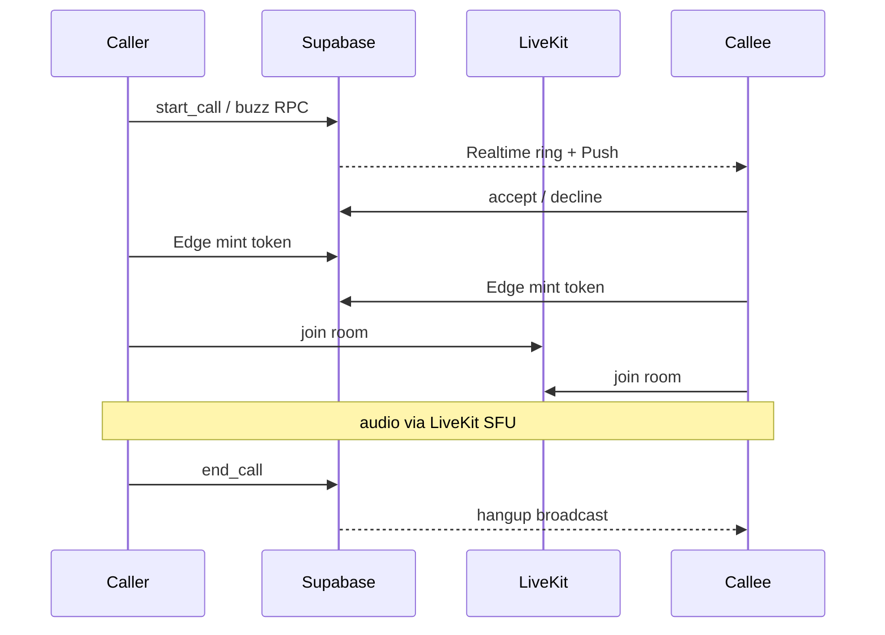

# Plan wdrożenia: połączenia głosowe + interkom (Messenger × biuro)

Status: **do wdrożenia** (nie rozpoczęte)  
Data: 2026-07-19  
Powiązane: [KOMUNIKATOR-ARCHITEKTURA-2026-07-17.md](./KOMUNIKATOR-ARCHITEKTURA-2026-07-17.md)

## Overview

Połączenia głosowe w stylu Messengera (1:1) plus interkom biurowy (buzz, PTT, pokój na kanale), oparte o istniejący czat Supabase + LiveKit do mediów WebRTC.

## Checklist wdrożenia

- [ ] Migracja `call_sessions` / `call_participants` + RPC start/respond/end/join room + RLS
- [ ] Edge `mint-livekit-token` + `notify-call`; env LiveKit
- [ ] `call.ts` + `livekit.ts` + store `activeCall` + Realtime ring/hangup
- [ ] `CallOverlay` + przycisk w `ConversationView` (DM 1:1) + system message po callu
- [ ] Buzz broadcast/push + PTT hold-to-talk na DM
- [ ] Pokój interkomu na kanale: join/leave, lista obecnych, opcjonalny buzz

## Cel produktowy

Hybryda dwóch zachowań w jednej aplikacji czatu:

| Tryb | Zachowanie | Gdzie |
|------|------------|--------|
| **Call** | Dzwonek → odbierz/odrzuć → full-duplex (jak Messenger) | DM 1:1 (`kind === "dm"` i 2 członków) |
| **Buzz** | Krótki sygnał „ej, jesteś?” bez otwierania rozmowy | DM 1:1 |
| **PTT** | Przytrzymaj = mówisz (half-duplex), puść = słuchasz | DM 1:1 oraz kanał |
| **Pokój** | Wspólny „korytarz” na kanale — dołącz/wyjdź, wielu naraz | `kind === "channel"` |

Wideo **poza V1** (tylko audio). Nagrywanie rozmów poza V1.

## Dlaczego ten stack

Mamy już: Realtime broadcast ([`src/lib/chat/typing.ts`](../src/lib/chat/typing.ts)), presence DB ([`src/lib/chat/presence.ts`](../src/lib/chat/presence.ts) — za wolne na ring), Web Push ([`src/lib/push.ts`](../src/lib/push.ts) + Edge Function), `getUserMedia` ([`src/lib/chat/voice.ts`](../src/lib/chat/voice.ts)), modele DM/channel ([`supabase/migrations/0014_chat_core.sql`](../supabase/migrations/0014_chat_core.sql)). **Brak WebRTC.**

- **Media: LiveKit Cloud** (SFU) — naturalne pod pokój kanału i PTT; mniej bólu z TURN niż goły `RTCPeerConnection`.
- **Sygnalizacja / stan sesji: Supabase** (tabele + Realtime + push) — spójne z mute/`notify` i RLS.
- **Tokeny LiveKit: Edge Function** `mint-livekit-token` (Deno, jak `notify-message`).

## Model danych (nowa migracja)

Sugerowana nazwa: `supabase/migrations/0028_calls.sql`.

### `call_sessions`

- `id`, `conversation_id`, `mode` (`call` | `ptt` | `room` | `buzz`)
- `state` (`ringing` | `active` | `ended` | `missed` | `declined`)
- `initiated_by`, `started_at`, `answered_at`, `ended_at`, `ended_reason`
- `livekit_room` (string, np. `call:{sessionId}` / `room:{conversationId}`)

### `call_participants`

- `(session_id, user_id)`, `role` (`caller` | `callee` | `member`), `joined_at`, `left_at`, `device_label`

### Buzz

Preferowane: broadcast + push + opcjonalny log system message „Buzz” (bez trwałej sesji). Alternatywa: lekki wiersz `mode=buzz` z krótkim TTL.

### RLS / RPC

- RLS: tylko `is_conversation_member(conversation_id)`.
- RPC: `start_dm_call`, `respond_call`, `end_call`, `join_channel_room`, `leave_channel_room`.
- Filtr dzwonienia jak w [`supabase/functions/notify-message/index.ts`](../supabase/functions/notify-message/index.ts): `notify != 'none'`, `muted_until`, nie autor.

Po zakończonym callu: system message w feedzie („Połączenie · 3:42” / „Nieodebrane”) — spójne z hubem.

## Realtime i obecność

- Kanał broadcast `call:{userId}` (jak typing) — eventy: `ring`, `buzz`, `accept`, `decline`, `hangup`, `ptt_start`, `ptt_stop`.
- **Presence na call:** LiveKit participant presence + krótki ping Realtime przy otwartej apce (DB `last_seen_at` 5 min jest za gruby na „czy odbierze teraz”).
- UI online: zielona kropka zostaje; przy callu dodatkowo stan „w rozmowie” z LiveKit.

## Media / LiveKit

- Edge Function wystawia JWT z `room`, `identity = userId`, grants `canPublish` / `canSubscribe`; dla PTT: publish tylko gdy przycisk wciśnięty (`setMicrophoneEnabled`).
- Pokój kanału: stała nazwa `intercom:{conversationId}` — dołączanie bez ringa (jak wejście do pokoju biurowego); opcjonalny „zapukaj” = buzz do online członków.
- Opuszczenie / utrata sieci: `end_call` lub leave participant; timeout ringa ~45 s → `missed` + push.

## UX — gdzie w UI

- Przycisk **telefon** + menu (Call / Buzz / PTT) w headerze [`ConversationView.tsx`](../src/components/chat/ConversationView.tsx) (obok wątków/decyzji) — DM 1:1.
- Kanał: przycisk **Interkom / Dołącz do pokoju** (nie klasyczny dzwonek do wszystkich naraz w V1).
- **Globalny overlay** (mount w [`App.tsx`](../src/App.tsx) / [`MobileShell.tsx`](../src/components/mobile/MobileShell.tsx)): incoming ring, aktywna rozmowa (mute, głośnik, zakończ), PTT hold-to-talk — widoczny niezależnie od taba.
- Deep-link: istniejący `#/czat/:id` + query/hash `?call=` przy kliknięciu push ([`src/sw.ts`](../src/sw.ts)).

## Push

Nowa Edge Function `notify-call` (lub rozszerzenie payloadu `notify-message`): tag `call-invite`, akcje Odebranie/Odrzucenie na platformach które to wspierają; na iOS PWA — best-effort (jak dziś przy wiadomościach). Ring live przez Realtime gdy apka otwarta; push gdy w tle.

## Fazy wdrożenia

### Faza 1 — Call 1:1 (Messenger)

Migracja sesji, mint token, overlay ring/active, przycisk w DM, system message po callu, honorowanie mute/notify.

### Faza 2 — Buzz + PTT na DM

Buzz (broadcast + push + lekki feedback UI), PTT half-duplex w tym samym pokoju LiveKit z `setMicrophoneEnabled`.

### Faza 3 — Pokój na kanale

Join/leave intercom room, lista „kto jest w pokoju”, opcjonalny buzz do kanału, brak masowego ringa do wszystkich.

### Faza 4 (później)

Call w DM >2 osób, wideo, transfer / parkowanie, historia jakości, self-host LiveKit.

## Integracja z kodem (główne pliki)

| Obszar | Pliki |
|--------|--------|
| Nowy klient | `src/lib/chat/call.ts`, `src/lib/chat/livekit.ts` |
| Nowy UI | `src/components/chat/CallOverlay.tsx`, `src/components/chat/PttButton.tsx` |
| Store | rozszerzenie [`src/lib/chat/store.ts`](../src/lib/chat/store.ts) o `activeCall` / incoming |
| Init | subskrypcja call broadcast obok `setupRealtime` w [`src/lib/chat/init.ts`](../src/lib/chat/init.ts) |
| DB | migracja `0028_calls.sql` |
| Edge | `supabase/functions/mint-livekit-token`, `supabase/functions/notify-call` |

### Env

- Edge (sekrety): `LIVEKIT_URL`, `LIVEKIT_API_KEY`, `LIVEKIT_API_SECRET`
- Frontend: `VITE_LIVEKIT_URL` (publiczny WS)

## Ryzyka (świadomie)

- iOS PWA: słabe tło / ring — dokumentować „zainstaluj PWA + pozwól na powiadomienia”.
- NAT: LiveKit Cloud załatwia TURN; bez tego office↔dom często pada.
- Koszt LiveKit: bill per participant-minute — pokój kanału z limitem (np. max N jednocześnie) w V1.
- Uprawnienia mic: reuse flow z [`src/lib/chat/voice.ts`](../src/lib/chat/voice.ts).

## Decyzje domknięte

- V1 = **B** (call + interkom), audio only.
- Call klasyczny: **tylko DM 1:1**; interkom PTT: DM + kanał; pokój: **kanał**.
- Media: **LiveKit Cloud**; stan/ring: **Supabase**.
