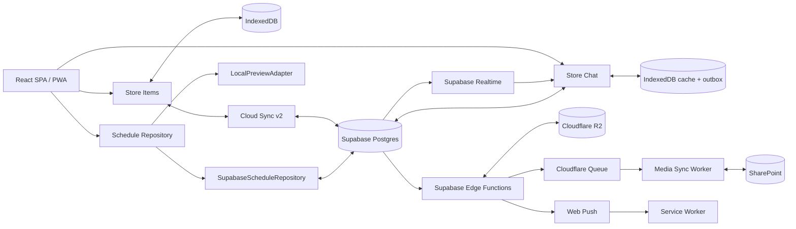

# Analiza aplikacji DoDo

**Data:** 23 sierpnia 2026  
**Wersja analizowana:** `a6ea61c` (`arena/01a02fb1-dodo`, stan zgodny z `main` przed sporządzeniem raportu)  
**Zakres:** produkt, architektura, jakość kodu, testy, bezpieczeństwo, wydajność, utrzymanie i rekomendacje.

> Raport jest analizą kodu i konfiguracji w repozytorium. Nie zastępuje testu penetracyjnego ani testów działającego środowiska Supabase, Cloudflare R2/Workers i SharePoint.

## 1. Podsumowanie zarządcze

DoDo nie jest już tylko „kalendarzem + ToDo”. Kod tworzy rozbudowaną platformę koordynacji pracy, obejmującą:

- kalendarz, zadania, checklisty, cykle i przypomnienia,
- współdzielenie wpisów i książkę kontaktów,
- komunikator z kanałami, DM, dyskusjami przy wpisach, wątkami, ankietami i rejestrami,
- organizacje, role, plany i administrację,
- galerie i załączniki z wielostopniowym pipeline'em R2 → SharePoint,
- harmonogramy budów, brygady i ewidencję obecności/RH,
- PWA, działanie lokalne, cache offline, Web Push i synchronizację w chmurze.

Produkt ma dużą wartość funkcjonalną i kilka dobrych decyzji architektonicznych: zunifikowany model zadania/wydarzenia, lokalny tryb bez chmury, osobny silnik czatu, RLS, adapter repozytorium harmonogramów oraz kontrolowany rollout mediów. Jednocześnie tempo rozwoju wyprzedziło infrastrukturę jakościową i dokumentację.

### Najważniejszy wniosek

**Aplikacja jest funkcjonalnie zaawansowana, ale przed dalszym skalowaniem wymaga krótkiego etapu stabilizacji.** Najpierw należy zamknąć krytyczną lukę uprawnień w funkcjach Storage, naprawić deterministyczną instalację zależności i uruchomić CI. Następnie potrzebne są testy integracyjne RLS/API oraz uporządkowanie modelu synchronizacji harmonogramów.

### Ocena orientacyjna

| Obszar | Ocena | Komentarz |
|---|---:|---|
| Wartość i kompletność produktu | 8/10 | Bardzo szeroki, spójny funkcjonalnie zakres operacyjny |
| Architektura | 6/10 | Dobre granice w części domen, ale trzy różne modele spójności i duże monolity |
| Jakość i testowalność | 6/10 | Strict TypeScript i 318 testów, lecz praktycznie wyłącznie testy czystej logiki |
| Bezpieczeństwo | 4/10 | RLS i dobre wzorce auth, ale wykryto krytyczną ekspozycję dwóch funkcji `SECURITY DEFINER` |
| Operacyjność | 5/10 | Dobre runbooki mediów, brak CI, automatycznych kontroli i powtarzalnego bootstrapu bazy |
| Wydajność frontendu | 5/10 | PWA i część lazy-loadingu działają, główny bundle jest jednak za duży |
| Dokumentacja | 5/10 | Dużo wiedzy operacyjnej, ale README i dokument preview są istotnie nieaktualne |

## 2. Co faktycznie zawiera aplikacja

### 2.1. Główne moduły produktu

1. **Kalendarz i zadania**
   - Jeden byt `Item` obsługuje wydarzenia i zadania.
   - Widoki: dzień, tydzień, 11 dni i miesiąc.
   - Drag & drop, wydarzenia całodniowe/wielodniowe, checklisty, uczestnicy, załączniki, deadline'y i cykle.
   - Lokalne przechowywanie w IndexedDB oraz opcjonalna synchronizacja z Supabase.

2. **Dashboard operacyjny**
   - Dzisiejsze wpisy, zadania i dane z harmonogramów.
   - Osobne warianty desktop/mobile.

3. **Komunikator i hub**
   - Kanały publiczne/prywatne, DM i rozmowy kontekstowe przy `Item`.
   - Wątki, przypięcia, reakcje, ankiety, checklisty, wzmianki, wiadomości głosowe i GIF-y.
   - Rejestry decyzji/notatek oraz konwersja wiadomości do zadania/wydarzenia.
   - Realtime, presence, typing, cache ostatnich wiadomości i trwały outbox.

4. **Organizacje**
   - Organizacje, członkowie, role, zaproszenia, limity miejsc i plany.
   - Administrator aplikacji i administrator organizacji.
   - Google OAuth z allowlistą.

5. **Media**
   - Galerie, miniatury, pliki i załączniki czatu.
   - Supabase przechowuje metadane i uprawnienia.
   - R2 jest warstwą „hot”, SharePoint archiwum „cold”, a Cloudflare Queue/Worker realizuje asynchroniczny transfer i retencję.

6. **Harmonogramy budów**
   - Budowy, kategorie, roboty, brygady, zdarzenia budowlane i dokumentacyjne.
   - Kolejka „Do wpisania”, konflikty brygad, katalogi i oś czasu.
   - Obecności, pracownicy, absencje, roboczogodziny i sprzęt.
   - Adapter lokalny oraz repozytorium Supabase.

### 2.2. Kierunek produktowy wymagający decyzji

Repozytorium łączy dwie narracje:

- prostą aplikację rodzinną/małego zespołu („Kalendarz + ToDo”),
- specjalistyczny system operacyjny dla firm budowlanych z organizacjami, RH, SharePointem i planami.

To nie jest wyłącznie problem marketingowy. Wpływa na nawigację, uprawnienia, onboarding, pakiety cenowe i zakres testów. Rekomendowane pozycjonowanie to **modułowa platforma koordynacji małych zespołów**, w której Kalendarz, Czat i Harmonogramy są jawnie oddzielnymi modułami. Obecny martwy atrybut `schedules_enabled` może stać się realnym mechanizmem entitlementu.

## 3. Architektura techniczna

### 3.1. Stack

| Warstwa | Technologia |
|---|---|
| Frontend | React 18, TypeScript, Vite 5, Tailwind CSS 3 |
| Stan | Zustand + IndexedDB przez `idb-keyval` |
| PWA | `vite-plugin-pwa`, własny service worker |
| Backend | Supabase Postgres, Auth, Realtime, Storage, Edge Functions |
| Media | Cloudflare R2, Queue i Worker + Microsoft Graph/SharePoint |
| Testy | Vitest 4 w aplikacji, Vitest 2 w Workerze |
| Deploy | Cloudflare Pages i Wrangler |

Aplikacja jest SPA bez klasycznego routera. Niewielki hash-router obsługuje deep-linki do rozmów, wątków i wpisów.

### 3.2. Przepływy danych



### 3.3. Trzy modele spójności

Aplikacja ma trzy niezależne strategie zapisu:

1. **Items:** local-first, trwały store IndexedDB, dirty-sety, debounce 800 ms, pull i Realtime.
2. **Czat:** append-oriented API, trwały outbox, cache 50 wiadomości/rozmowę i rozbudowane Realtime.
3. **Harmonogramy:** optymistyczny stan w pamięci, wiele zapisów fire-and-forget, ponowienie przy reloadzie/focusie, bez trwałego outboxa i bez subskrypcji Realtime.

Oddzielenie czatu od snapshotowego syncu Items jest prawidłowe. Najsłabszym ogniwem jest trzeci model: użytkownik widzi zapis natychmiast, ale zamknięcie karty po błędzie sieci może utracić nieutrwalone zmiany.

## 4. Skala repozytorium

| Metryka | Wartość |
|---|---:|
| Śledzone pliki | 395 |
| TypeScript/TSX | ok. 73 013 linii, w tym testy |
| SQL | ok. 7 922 linie |
| Migracje Supabase | 63 (`0001`–`0063`) |
| Pliki testowe | 28 łącznie z Workerem |
| Linie testów | ok. 4 697 |
| Komponenty React | 113 plików / ok. 38 247 linii |
| Definicje `CREATE TABLE` w historii migracji | 48 |
| Definicje polityk RLS w historii migracji | 101 |

Największe pliki produkcyjne:

| Plik | Linie |
|---|---:|
| `src/components/projectsPreview/ScheduleTab.tsx` | 4 841 |
| `supabase/functions/gallery-api/index.ts` | 2 963 |
| `src/lib/schedules/supabaseScheduleRepository.ts` | 1 775 |
| `src/components/item/ItemEditorPanel.tsx` | 1 768 |
| `src/lib/projectsPreview/repository.ts` | 1 695 |
| `src/components/hub/WorkspaceHub.tsx` | 1 649 |
| `src/lib/chat/api.ts` | 1 635 |
| `src/lib/chat/init.ts` | 1 518 |
| `src/components/chat/ConversationView.tsx` | 1 423 |
| `src/components/chat/MessageBubble.tsx` | 1 416 |
| `worker/src/index.ts` | 1 057 |
| `src/lib/cloud.ts` | 1 042 |

Tak duże pliki nie są automatycznie błędem, ale utrudniają review, izolację regresji i równoległą pracę kilku osób.

## 5. Wyniki uruchomionych kontroli

### 5.1. Instalacja

Czyste `npm ci` w katalogu głównym **nie działa**:

```text
npm ci can only install packages when package.json and package-lock.json are in sync
Missing: esbuild@0.28.2 from lock file
```

Do wykonania dalszych kontroli tymczasowo wygenerowano poprawny lock przez `npm install`; zmiana nie została pozostawiona w repozytorium.

Worker ma poprawny lock i `npm ci` zakończyło się sukcesem.

### 5.2. Testy i typecheck

| Kontrola | Wynik |
|---|---|
| `npm test` | **PASS** — 27 plików, 309 testów |
| `npm test --prefix worker` | **PASS** — 1 plik, 9 testów |
| `npm run typecheck --prefix worker` | **PASS** |
| `npm run build` | **PASS po tymczasowej naprawie locka** |

Testy dobrze pokrywają czystą logikę m.in. cykli, przypomnień, feedu czatu, markdownu, routingu uploadu, polityki pipeline'u mediów i logiki harmonogramów.

Nie znaleziono testów komponentów React, testów przeglądarkowych, testów API/Edge, testów realnej bazy ani automatycznych testów RLS. Vitest działa w środowisku `node`, a konfiguracja obejmuje tylko `src/**/*.test.ts`.

### 5.3. Build i rozmiar

Build produkcyjny zakończył się sukcesem, ale Vite zgłosił nieskuteczne dynamiczne importy oraz chunk powyżej 500 kB.

| Artefakt | Rozmiar | Gzip |
|---|---:|---:|
| Główny JS | 1 258,56 kB | 342,84 kB |
| PDF JS | 365,12 kB | 107,61 kB |
| PDF worker | 1 375,84 kB | — |
| CSS | 66,65 kB | 12,61 kB |
| Całe `dist` | ok. 4,9 MB | — |
| Precache PWA | ok. 3 557,57 KiB / 29 wpisów | — |

Dla aplikacji PWA używanej mobilnie to zauważalny koszt pierwszego uruchomienia i aktualizacji.

### 5.4. Zależności

Audyt po tymczasowej regeneracji locka:

- aplikacja: 7 alertów narzędziowych (5 high, 2 moderate),
- Worker: 11 alertów narzędziowych (1 critical, 6 high, 4 moderate),
- `npm audit --omit=dev`: **0 alertów** zarówno dla aplikacji, jak i Workera.

Wnioski:

- alerty dotyczą obecnie toolchainu deweloperskiego, nie zależności runtime wysyłanych użytkownikowi,
- mimo to należy je usunąć, szczególnie stare `vitest@2.1.9` i `wrangler@4.113.0` w Workerze,
- krytyczny advisory Vitest dotyczy serwera UI; zwykłe `vitest run` ogranicza ekspozycję, ale nie uzasadnia pozostawienia starej wersji.

## 6. Mocne strony

### 6.1. Dobre granice domenowe w kluczowych miejscach

- `Item` jako wspólny byt wydarzenia i zadania upraszcza konwersję oraz widoki.
- Czat nie został wtłoczony do snapshotowego syncu Items.
- Harmonogramy mają jawny port `ScheduleRepository` i wymienne adaptery.
- Pipeline mediów ma rozdzielone role: metadane/uprawnienia, hot storage, kolejka i archiwum.

### 6.2. Local-first i odporność użytkowa

- Aplikacja działa bez Supabase.
- Items i ustawienia są trwałe w IndexedDB.
- Czat ma trwały outbox i ograniczony cache offline.
- Service worker implementuje network-first dla nawigacji i cache-first dla hashowanych assetów.
- Aktualizacje aplikacji są powiązane z SHA buildu i rekordem `app_release`.

### 6.3. Bezpieczeństwo zaprojektowane jako część domeny

- Wszystkie 48 tabel definiowanych w migracjach mają RLS.
- Funkcje `SECURITY DEFINER` ustawiają jawny `search_path`, co ogranicza klasę ataków przez podmianę obiektów.
- OAuth używa PKCE i ma ochronę przed open redirect.
- Auth Hook weryfikuje podpis Standard Webhooks.
- Media mają prywatne buckety, signed URLs i backendową decyzję o pipeline.
- Markdown jest renderowany jako segmenty React, bez `dangerouslySetInnerHTML`.

Powyższe nie usuwa krytycznego problemu opisanego niżej, ale pokazuje dobrą bazę do jego szybkiego naprawienia.

### 6.4. Dobre podejście do rolloutów mediów

- `orgs.media_pipeline` jest źródłem prawdy.
- Flaga Vite jest wyłącznie kill switchem.
- Operacje są idempotentne i mają retry.
- Istnieją runbooki, retencja i ścieżka rollbacku.

## 7. Rejestr ryzyk i problemów

### P0 — krytyczne

#### SEC-01: publicznie wykonywalne funkcje `SECURITY DEFINER` modyfikujące Storage

**Lokalizacja:** `supabase/migrations/0043_message_forward_move.sql:31–105`

Funkcje:

- `public._chat_storage_copy(text, text)`,
- `public._chat_storage_move(text, text)`

są `SECURITY DEFINER`, bez kontroli `auth.uid()`, członkostwa rozmowy lub ścieżki. Bezpośrednio usuwają, kopiują i zmieniają nazwy rekordów `storage.objects` w buckecie `chat-attachments`.

Repozytorium nie zawiera `ALTER DEFAULT PRIVILEGES`, które odbierałoby domyślne `EXECUTE` roli `PUBLIC`, ani późniejszego `REVOKE` dla tych dwóch funkcji. Nazwa zaczynająca się od `_` nie ukrywa funkcji przed PostgREST.

**Skutek:** jeśli środowisko zdalne nie ma dodatkowych uprawnień ustawionych poza migracjami, klient anonimowy lub zalogowany może potencjalnie wywołać RPC i przenosić/kopiować cudze obiekty Storage z pominięciem RLS.

**Działanie natychmiastowe:** przygotować migrację bezpieczeństwa:

```sql
revoke all on function public._chat_storage_copy(text, text)
  from public, anon, authenticated;
revoke all on function public._chat_storage_move(text, text)
  from public, anon, authenticated;
```

Funkcje powinny pozostać wewnętrznymi helperami wywoływanymi przez kontrolowane RPC `SECURITY DEFINER`. Następnie trzeba:

1. sprawdzić uprawnienia na produkcji w `information_schema.routine_privileges`,
2. przetestować bezpośrednie RPC jako `anon` i zwykły użytkownik,
3. przejrzeć wszystkie bieżące funkcje `SECURITY DEFINER`, nie tylko historię migracji,
4. ustawić bezpieczne `ALTER DEFAULT PRIVILEGES` dla przyszłych funkcji.

W historii migracji występuje 108 definicji `SECURITY DEFINER`, a tylko 7 jawnych `REVOKE ALL ON FUNCTION`. Część funkcji ma poprawne kontrole wewnętrzne, lecz sam `GRANT ... TO authenticated` nie odbiera domyślnego prawa `PUBLIC`.

### P1 — wysokie

#### BUILD-01: niedeterministyczna instalacja zależności

`npm ci` nie działa na śledzonym `package-lock.json`. Uniemożliwia to wiarygodny build od czystego checkoutu i zablokuje poprawnie skonfigurowane CI.

**Rekomendacja:** wygenerować lock bieżącą, ustaloną wersją Node/npm, zatwierdzić zmianę i egzekwować `npm ci` w CI.

#### QA-01: brak CI oraz brak testów granic systemu

Repozytorium nie zawiera `.github/workflows`, ESLint ani skryptu lint. Obecne 318 testów są wartościowe, lecz nie wykrywają regresji w:

- renderowaniu i obsłudze komponentów,
- krytycznych przepływach desktop/mobile,
- OAuth, PWA i offline,
- RLS oraz RPC `SECURITY DEFINER`,
- migracjach Supabase,
- Edge Functions i pipeline'ach zewnętrznych.

**Rekomendacja:** CI: `npm ci`, `npm test`, `npm run build`, Worker `npm ci/test/typecheck`, audit i test migracji. Następnie Playwright i testy lokalnego Supabase.

#### DATA-01: harmonogramy nie mają trwałego mechanizmu synchronizacji

`SupabaseScheduleRepository` wykonuje liczne zapisy przez `void this.sync...`. Pending operations żyją w pamięci obiektu; brak trwałego outboxa. Repozytorium nie subskrybuje Realtime — odświeża dane przy focusie/visibility.

**Skutek:** zamknięcie karty lub crash podczas błędu sieci może zgubić zmianę, mimo że optymistyczny UI pokazał sukces. Dwie otwarte sesje widzą zmiany z opóźnieniem.

**Rekomendacja:** co najmniej jawny stan `saving/saved/error`, retry z backoffem i blokada zamknięcia przy pending. Docelowo trwały outbox IndexedDB lub transakcyjne RPC dla operacji wielotabelowych oraz Realtime/polling z wersjonowaniem.

#### OPS-01: bootstrap bazy wymaga ręcznej edycji migracji

Migracje `0002_cron.sql` i `0017_chat_push.sql` zawierają aktywne placeholdery `<PROJECT_REF>` i `<CHAT_PUSH_SECRET>`. README instruuje także wybiórcze pomijanie migracji Google. To nie jest bezpieczny, automatyczny proces `supabase db push`.

**Skutek:** nowe środowisko może mieć formalnie zastosowane migracje, lecz niedziałający push lub placeholder jako sekret. Ręczne różnice między środowiskami nie są widoczne w Git.

**Rekomendacja:** wynieść konfigurację cron/webhooków do jawnego skryptu bootstrap/deploy korzystającego z sekretów lub Vault; migracje mają tworzyć wyłącznie neutralny schemat. Dodać test odtworzenia pustego środowiska.

#### SEC-02: niepełna ochrona SSRF w `link-preview`

Funkcja blokuje literalne adresy prywatne tylko dla początkowego URL, ale używa `redirect: "follow"`. Nie sprawdza każdego redirectu i nie weryfikuje adresów DNS domeny.

**Skutek:** zalogowany użytkownik może próbować przekierować funkcję na adres prywatny lub wykorzystać DNS rebinding. Timeout i limit 512 kB ograniczają DoS, lecz nie zamykają SSRF.

**Rekomendacja:** `redirect: "manual"`, walidacja każdego `Location`, limit liczby redirectów, walidacja rozwiązanego IP A/AAAA lub zewnętrzny bezpieczny fetch proxy. Dodać testy redirect → localhost/private IPv4/IPv6.

#### SEC-03: brak polityki nagłówków bezpieczeństwa

Nie znaleziono `_headers`, CSP, `X-Content-Type-Options`, `Referrer-Policy`, `Permissions-Policy` ani polityki frame ancestors.

**Rekomendacja:** dodać konfigurację Cloudflare Pages. CSP trzeba dopasować do Supabase, R2, obrazów podglądów, Tenor/Giphy i DiceBear; zacząć od `Content-Security-Policy-Report-Only`.

#### PERF-01: duży główny bundle i zbyt szeroki precache

Główny JS ma 1,26 MB minified, a PWA precache obejmuje ok. 3,56 MiB. Vite sygnalizuje, że część `dynamic import()` nie tworzy osobnych chunków, ponieważ te same moduły są importowane statycznie.

**Rekomendacja:** przeanalizować bundle visualizerem, odseparować czat/harmonogramy/PDF od startowego grafu, wprowadzić `manualChunks` dopiero po usunięciu importów krzyżowych i nie precache'ować ciężkiego PDF workera, jeżeli nie jest potrzebny offline.

### P2 — średnie

#### MAINT-01: monolity kodu

`ScheduleTab.tsx` ma 4,8 tys. linii, a kilka kluczowych plików 1–3 tys. linii. Najbardziej opłacalny podział:

- `ScheduleTab`: warstwy danych, viewport/zoom, DnD, lane'y i toolbar,
- `gallery-api`: routing akcji, auth/policy, R2, Graph i serializacja,
- `SupabaseScheduleRepository`: read model, command handlers, pending queue,
- `ItemEditorPanel`: sekcje formularza i model draftu,
- `chat/init`: lifecycle, realtime, commands i outbox.

#### DOC-01: dokumentacja nie opisuje bieżącego systemu

Przykłady:

- README mówi o widoku 9 dni, kod ma 11 dni.
- README kończy listę migracji na `0019`, repo ma `0063`.
- README nie opisuje `gallery-api`, Workera R2 ani produkcyjnych harmonogramów.
- `PROJECTS_PREVIEW.md` nadal twierdzi, że brak SQL/RLS/sync i produkcyjnego modułu, choć istnieją migracje `0054`–`0063` oraz adapter Supabase.
- Struktura w README wymienia nieistniejące lub zmienione komponenty.

**Rekomendacja:** jeden aktualny `ARCHITECTURE.md`, krótki README startowy i osobne runbooki. Dokumenty historyczne oznaczyć jako archived/superseded.

#### FLAGS-01: `schedules_enabled` jest martwą flagą

Baza, RPC i modele TypeScript przechowują `schedulesEnabled`, ale:

```ts
export function isSchedulesModuleEnabled(_schedulesEnabled?: boolean): boolean {
  return true;
}
```

Flaga nie wpływa na UI ani wybór repozytorium, a `setOrgSchedulesEnabled` nie jest używane przez komponenty.

**Rekomendacja:** usunąć martwy mechanizm albo przywrócić go jako rzeczywisty entitlement modułu. Obecny stan jest mylący operacyjnie.

#### OBS-01: ograniczona obserwowalność

Większość błędów frontendowych kończy się w `console.warn`. Media mają dokumentację sygnałów, ale repo nie definiuje alertów ani centralnego śledzenia błędów. Brak pomiaru jakości synchronizacji i czasu zapisu.

**Rekomendacja:** lekkie error tracking oraz metryki: błędy syncu, wiek outboxa, czas potwierdzenia uploadu, backlog kolejki, p95 operacji harmonogramu i wersja klienta.

#### A11Y-01: modale i złożone interakcje wymagają audytu dostępności

Bazowy `Modal` nie ma `role="dialog"`, `aria-modal`, focus trap, autofocusu ani przywracania focusu. Aplikacja ma wiele DnD, osi czasu i ikonowych akcji, więc sama liczba `aria-label` nie gwarantuje obsługi klawiaturą.

**Rekomendacja:** axe + testy klawiatury, focus management, alternatywy dla DnD i opis semantyczny osi czasu.

#### REL-01: wersja produktu pozostaje `0.1.0`

Release'y są technicznie identyfikowane SHA, co jest dobre, ale stała wersja `0.1.0` nie daje czytelnej semantyki wydania ani changelogu użytkowego.

**Rekomendacja:** przyjąć prosty SemVer lub numer daty release i automatycznie generować changelog/release notes.

## 8. Rekomendowany plan działań

### 0–48 godzin: bezpieczeństwo i powtarzalność

1. Zablokować bezpośrednie wykonanie `_chat_storage_copy` i `_chat_storage_move`.
2. Zweryfikować prawa funkcji na produkcji oraz wykonać test RPC jako `anon`.
3. Przejrzeć wszystkie aktualne funkcje `SECURITY DEFINER` i ustawić default privileges.
4. Naprawić `package-lock.json`, tak aby czyste `npm ci` działało.
5. Dodać minimalne CI blokujące merge przy błędzie testów/builda.

### 1–2 tygodnie: niezawodność

1. Uruchomić lokalny Supabase w CI i testować migracje od zera.
2. Dodać macierz testów RLS: owner/member/obcy/anon dla Items, czatu, Storage i harmonogramów.
3. Dodać Playwright dla pięciu ścieżek krytycznych:
   - logowanie i bootstrap organizacji,
   - utworzenie i synchronizacja zadania/wydarzenia,
   - wiadomość → zadanie,
   - upload/odczyt/usunięcie załącznika,
   - zapis harmonogramu i obecności po utracie/odzyskaniu sieci.
4. Dodać widoczny status zapisu i trwały retry dla harmonogramów.
5. Zamknąć SSRF i dodać nagłówki bezpieczeństwa.
6. Zaktualizować toolchain i usunąć alerty `npm audit`.

### 3–6 tygodni: skalowalność rozwoju

1. Rozbić największe moduły, zaczynając od `ScheduleTab`, `gallery-api` i repozytorium harmonogramów.
2. Zmniejszyć bundle startowy i zakres precache PWA.
3. Ujednolicić dokumentację i proces odtwarzania środowiska.
4. Zdecydować o pozycjonowaniu i modułach/entitlementach.
5. Dodać podstawową obserwowalność i SLO:
   - skuteczność syncu > 99,9%,
   - brak outboxa starszego niż ustalony próg,
   - alarm przy backlogu media sync,
   - p95 czasu zapisu harmonogramu.

## 9. Proponowana docelowa organizacja kodu

```text
src/
  app/                 bootstrap, shell, navigation, providers
  domains/
    items/             model, store, sync, UI
    chat/              API, realtime, outbox, UI
    schedules/         port, local/cloud adapters, commands, UI
    orgs/              auth, membership, plans, admin
    media/             upload policy, galleries, diagnostics
  shared/
    ui/                dostępne prymitywy UI
    infra/             Supabase, IndexedDB, telemetry
    utils/
supabase/
  migrations/          neutralny schemat i RLS
  functions/           małe funkcje per odpowiedzialność
worker/
  src/
    routes/
    queue/
    graph/
    retention/
tests/
  e2e/
  rls/
  integration/
```

Nie ma potrzeby wykonywać jednorazowego „big bang” refactoru. Granice można wprowadzać przy kolejnych zmianach, pod warunkiem wcześniejszego dodania testów kontraktowych.

## 10. Wniosek końcowy

DoDo ma solidny rdzeń produktowy i jest znacznie bliżej specjalistycznego systemu operacyjnego dla małych zespołów niż prostego kalendarza. Największym atutem jest integracja komunikacji, zadań, harmonogramu i mediów w jednym kontekście. Największym ryzykiem nie jest brak funkcji, lecz utrzymanie niezawodności i bezpieczeństwa przy rosnącej złożoności.

**Rekomendacja decyzji:** wstrzymać dodawanie dużych modułów na jeden krótki sprint stabilizacyjny. Po usunięciu SEC-01, naprawie locka, uruchomieniu CI i dodaniu testów RLS aplikacja będzie miała znacznie bezpieczniejszą podstawę do dalszego rozwoju.

---

## Załącznik A — wykonane komendy

```bash
npm ci                              # FAIL — lock niespójny
npm install                         # tymczasowo, tylko do audytu
npm test                            # PASS — 309
npm run build                       # PASS po npm install
npm audit
npm audit --omit=dev                # 0 runtime advisories

cd worker
npm ci                              # PASS
npm test                            # PASS — 9
npm run typecheck                   # PASS
npm audit
npm audit --omit=dev                # 0 runtime advisories
```

Po audycie oryginalny `package-lock.json` został przywrócony; raport nie maskuje problemu przez niezapowiedzianą zmianę zależności.

## Załącznik B — ograniczenia analizy

Nie wykonano:

- testów na produkcyjnych danych,
- aktywnego testu penetracyjnego,
- testów bezpośrednio na zdalnym Postgresie/R2/SharePoint,
- pomiarów Web Vitals na realnym urządzeniu,
- pełnej walidacji dostępności przez czytnik ekranu,
- testu odtworzenia wszystkich migracji w lokalnym Dockerze Supabase.